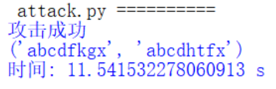

# Implement the naïve birthday attack of reduced SM3

## 前言、项目说明

本项目实现了精简版的基于SM3的生日攻击

## 一、生日攻击

### 概述

生日攻击是基于生日悖论建立的一种攻击方式，这种攻击可以在较小的时间内以至少 $\frac{1}{2}$ 的概率找到一组碰撞

### 生日问题

假设有m (m < 365)名个体，他们的出生日期在一年（365天）中被随机地分散。我们需要找到合适的m值，以确保至少有两人具有相同的出生日期的概率超过$\frac{1}{2}$。

> 答案：考虑m个人生日都不同的概率，则m=23。
>
> 计算过程如下：
>
> > $\ \ \ \ \ \ \overline{p(m)}=1*(1-\frac{1}{365})*...*(1-\frac{m-1}{365})=\prod_{i=1}^{m-1}(1-\frac{i}{365})$
> >
> > $\because\ \ e^{-x}\approx 1-x$
> >
> > 
> >
> > $\therefore\ \ \overline{p(m)}\approx 1*e^{-\frac{1}{365}}*e^{-\frac{2}{365}}*...*e^{-\frac{m-1}{365}}=e^{-\frac{\frac{m(m-1)}{2}}{365}}$
> >
> > $\ \ \ \ \ \ p(m)=1-\overline{p(m)}\approx1-e^{-\frac{\frac{m(m-1)}{2}}{365}}\approx 1-e^{\frac{m^2}{2*365}}=\frac{1}{2}$
> >
> > $\ \ \ \ \ \ m\approx\sqrt{2ln2\times365}\approx1.17\sqrt{365}$ 
> >
> > $\therefore\ \left \lceil m\right \rceil=23$
>
> 对上述情况做出推广，得到：
>
> > $p(m)\approx1-e^{-\frac{\frac{m(m-1)}{2}}{N}}\approx 1-e^{\frac{m^2}{2\times N}}$
> >
> > $m\approx\sqrt{2ln\frac{1}{1-p(m)}\times N}$ 
> >
> > 当 $p(m)\approx0.5$ 时，$m\approx1.17\sqrt{N}$

### Hash函数的生日攻击

#### 定理

假定杂凑函数h的输出长度为n位比特，经过大约$2^{\frac{n}{2}}$次杂凑运算，找到一对发生碰撞的消息$(x, x')$的概率至少为$\frac{1}{2}$。

> 输出值长n比特→$N=2^n$
>
> $N^{\frac{1}{2}}=2^{\frac{n}{2}}$

#### 实现思路

通过不断随机选择随机字符串进行哈希，并将哈希值记录下来，每次做完哈希都将本次的哈希值与之前进行对比，当找到相同的哈希值时，意味着我们成功找到了一组碰撞。

## 二、具体实现

#### 导入所需环境、给定字符空间

代码功能：

> - `itertools`：内含迭代工具，可生成字符串的各种排列与组合
> - `base64`：可进行base64数据的加解密操作
> - `binascii`:转换二进制和ASCII码
> - `gmssl`:执行SM3哈希计算
> - `alphatable`：包括全部小写字母，用作穷举攻击的字符空间

代码展示：

```python
import random
import itertools
import base64
import binascii
from time import time
from gmssl import sm3, func
alphatable = "abcdefghijklmnopqrstuvwxyz"
```

#### 攻击函数实现

代码功能：

> 1. 为了储存已计算的哈希值和对应的字符串，初始化一个空字典 `hashmap`。
> 2. 利用 `itertools.permutations` 对包含所有小写字母的字符串 `alphatable` 进行排列组合，生成所有长度为 `length` 的字符串。
>
> 3. 针对每个生成的字符串，按照以下步骤进行处理：
>
>    - 将字符串转换为字节数据，使用 `bytes` 函数进行编码。
>
>    - 运行 `sm3_hash` 函数进行 SM3 哈希运算，生成哈希值。
>
>    - 对哈希值进行切片操作，保留前 `n` 个字节，限制碰撞长度。
>
> 4. 检查当前计算得到的哈希值是否存在于 `hashmap`
>
>    字典中：
>
>    - 若哈希值已经在字典中，表示发生了碰撞，即找到两个不同的输入，其哈希值相同，攻击成功。
>    - 若哈希值不在字典中，将当前哈希值及对应的字符串存储到 `hashmap` 中，为后续检查是否发生碰撞做准备。
>
> 5. 重复上述步骤，直到完成 `num` 次攻击或找到碰撞为止。
>
> 6. 若 `num` 次攻击完成后仍未找到碰撞，则函数输出攻击失败信息。但如果找到碰撞，函数将输出攻击成功信息，并返回碰撞的哈希值和对应的字符串。

代码展示：

```python
#查找并加入,num为攻击次数，length为字符串长度
def attack(num,n,length):
    hashmap={}
    i = 0
    for s in itertools.permutations(alphatable,length):
        i+=1
        strs=""
        for k in range(length):
            strs+=s[k]
        data = bytes(strs, encoding='utf-8')
        #切片大小界定碰撞长度
        sign = sm3.sm3_hash(func.bytes_to_list(data))[:n]
        if sign in hashmap:
          print("攻击成功")
          return (hashmap[sign],strs)
        else:
            hashmap[sign]=strs
        if i>=num:
            break
    print("攻击失败")
    return (0, 0)
```

#### 主程序实现

代码功能：

> 1. 调用 `attack` 函数，设置 `num` 为 2^16 (65536)，`n` 为 7，`length` 为 8，即对长度为 8 的字符串进行 65536 次排列组合攻击
> 2. 输出攻击的结果和时间

代码展示：

```python
start = time()
print(attack(pow(2,16),7,8))
end = time()
print("时间:",end-start, "s")
```

## 三、实现效果

在本次实验中，我们选择对前32bit进行碰撞测试。则找到的一对长度为8字节，hash值前28bit碰撞的字符串，如下图所示：



## 四、参考

PPT：20230330-sm3-public
