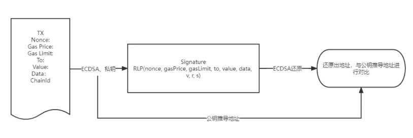
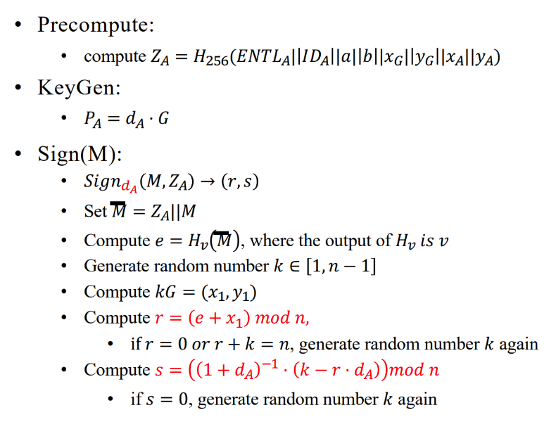

# Report on the application of this deduce technique in Ethereum with ECDSA
从签名中推断出公钥信息，这种推导技术在以太坊中使用ECDSA的应用

## 一、Ethereum签名：ECDSA

首先根据参考【1】对Ethereum中的ECDSA签名做一个简单的介绍。

ECDSA可理解为以太坊、比特币对消息、交易进行签名与验证的算法与流程。

在以太坊中，ECDSA算法可以用于从签名中推导出公钥。这个功能在以太坊中的身份验证和签名验证过程中非常重要。当一个交易被广播到以太坊网络时，它必须被验证，以确保它是由合法的发送者发送的。ECDSA算法可以用于验证交易的签名，并从签名中推导出发送者的公钥，从而验证发送者的身份。

## 二、算法流程

- 签名即正向算法（消息 + 私钥 + 随机数）= 签名，其中消息是公开的，私钥是隐私的，经过ECDSA正向算法可得到签名，即r、s、v（不用纠结与r、s、v到底什么，只需要知道这就是签名即可）。

- 验证即反向算法（消息 + 签名）= 公钥，其中消息是公开的，签名是公开的，经过ECDSA反向算法可得到公钥，然后对比已公开的公钥。

### 签名

### 验证

1. 从交易中提取签名信息：交易包含一个数字签名，由r、s和v三个值组成，其中r和s是签名的一部分，v是用于推导公钥的参数。
2. 计算消息哈希：以太坊使用Keccak-256哈希函数计算交易的消息哈希。
3. 推导公钥：利用ECDSA算法和消息哈希，可以推导出签名者的公钥。具体步骤如下：
4. 由r、s和消息哈希计算出签名的椭圆曲线上的点P。
5. 计算曲线上另一个点Q，使其满足Q = dG，其中G是椭圆曲线上的生成点，d是私钥。
6. 利用P和Q推导出公钥K，满足K = r^-1(sP - Q)。
7. 验证公钥：将推导出的公钥与交易中的发送者地址进行比较，以验证发送者的身份。

## 三、参考
【1】 https://learnblockchain.cn/article/5012

【2】 https://blog.csdn.net/weixin_43867940/article/details/130258535

【3】 https://bitcoin.stackexchange.com/questions/38351/ecdsa-v-r-s-what-is-v

【4】 PPT：20230401-sm2-public