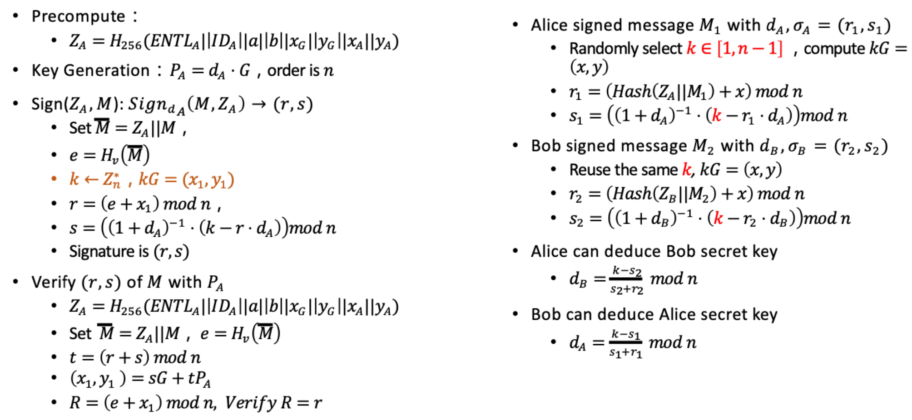
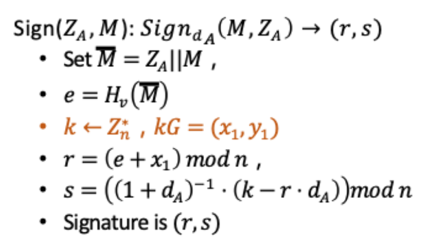
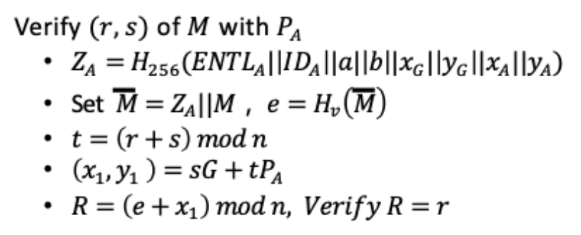

# impl sm2 with RFC6979

## project简介



## 具体实现

### 实验环境

基于pycharm编译器导入bitcoin库、hashlib库、自编写文件MyFunc后，运行SM2文件即可。

### 基于RFC6979的SM2实现

#### 准备

利用下述指令安装bitcoin库：

```python
pip install bitcoin
```

#### 软件环境配置、参数初始化

###### 代码功能

导入自编写文件、库，初始化有限域的阶、椭圆曲线的阶和基本点、圆锥曲线相关参数，由MyFunc.py密钥生成函数生成公私钥对。

###### 代码呈现

```python
#设置椭圆曲线和有限域的阶
FIELD_ORDER = 0xFFFFFFFEFFFFFFFFFFFFFFFFFFFFFFFFFFFFFFFF00000000FFFFFFFFFFFFFFFF
CURVE_ORDER = 0xFFFFFFFEFFFFFFFFFFFFFFFFFFFFFFFF7203DF6B21C6052B53BBF40939D54123
POINT_X = 0x32C4AE2C1F1981195F9904466A39C9948FE30BBFF2660BE1715A4589334C74C7
POINT_Y = 0xBC3736A2F4F6779C59BDCEE36B692153D0A9877CC62A474002DF32E52139F0A0
BASE_POINT = (POINT_X, POINT_Y)

#设置椭圆曲线参数
CURVE_PARAM_A = 0xFFFFFFFEFFFFFFFFFFFFFFFFFFFFFFFFFFFFFFFF00000000FFFFFFFFFFFFFFFC
CURVE_PARAM_B = 0x28E9FA9E9D9F5E344D5A9E4BCF6509A7F39789F515AB8F92DDBCBD414D940E93

secret_key, public_key = MF.generate_key()      #调用MF.generate_key()生成密钥对
```

#### 计算消息的标识符ZA

###### 代码思路

定义函数cal_ZA，实现对传递参数ID、椭圆曲线参数A1 B1、G点X1 Y1、公钥pk1 pk2的拼接，继而由sha256算法对其进行哈希。

###### 代码呈现

```python
'''计算消息的标识符ZA'''
def cal_ZA(ID, A1, B1, X1, Y1, pk1, pk2):
    #获取bit位数
    ENTLA=str(len(ID.encode()) << 3)
    #将所有输入混合进行拼接后利用sha256进行哈希
    mix_mes = ENTLA + ID + str(A1) + str(B1) + str(X1) + str(Y1) + str(pk1) + str(pk2)
    hash = int(sha256(mix_mes.encode('utf-8')).hexdigest(),16)
    return hash
```

#### 签名

###### 流程展示



###### 代码思路

1. 将消息标识符 `ZA` 和消息 `mes` 拼接起来，利用 SHA-256 哈希算法计算哈希值 `hash1`
2. 由 `int(hash1, 16)` 将其转换为整数 `hash2`
3. 通过 `bitcoin.main.deterministic_generate_k(hash1, private_key)` 函数，由哈希值 `hash1` 、私钥 `private_key` 确定随机数 `k`
4. 将随机数 `k` 、基本点 `basic_point` 进行椭圆曲线上的点乘法运算，得到点 `G`
5. 将签名结果存储在 `sign` 列表中。列表中应有两个元素：
   - `(hash2 + G[0]) % P2`，即消息哈希值 `hash2` 与点 `G` 的 x 坐标相加，然后再取模 `P2`
   - `(MyFunc.calculate_inverse(1 + pk, P2) * (k - sign[0] * pk)) % P2`用于计算椭圆曲线上的第二个坐标
6. `sign` 列表作为签名结果返回
7. 进行实际签名操作
   1. 调用 `cal_ZA` 函数计算消息标识符 `ZA`
   2. 调用 `Sig` 函数对消息进行签名
   3. 将签名结果存储在变量 `sign` 中

###### 代码呈现

```python
'''签名'''
def Sig(pk, mes, ZA):
    hash1 = sha256(str(ZA+mes).encode('utf-8')).hexdigest()
    hash2 = int(hash1,16)
    # 生成随机数k，利用k与基本点相乘得到一个随机的点G
    k = bitcoin.main.deterministic_generate_k(hash1,private_key)
    #k = 1
    G = MyFunc.ECC_multiply(k, basic_point)

    sign = []
    sign.append(( hash2+G[0] ) % P2)
    sign.append((MyFunc.calculate_inverse(1 + pk, P2) * (k - sign[0] * pk)) % P2)  #用私钥进行签名
    return sign

mes = "HelloJason"
ID='murphywinter'
ZA=str(cal_ZA(ID, A, B, X, Y, public_key[0], public_key[1]))
sign = Sig(private_key, mes, ZA)
```

#### 验证

###### 流程展示



###### 代码思路

该步骤的核心思路是：通过对消息标识符 `ZA` 和消息 `mes` 进行哈希运算，然后利用椭圆曲线上的点运算进行签名验证。如果验证通过，说明签名是由拥有对应私钥的实体生成的，并且消息在传递过程中没有被篡改。实现细节如下：

1. 调用 `cal_ZA` 函数计算消息的标识符 `ZA`
2. 将消息的标识符 `ZA` 和消息 `mes` 进行拼接，然后利用 SHA-256 哈希算法计算哈希值 `hash`，并将其转换为整数
3. 使用签名中的第二个元素 `sign[1]` 与基本点 `basic_point` 进行椭圆曲线上的点乘法运算，得到一个新的点 `mul1`
4. 使用签名中的第一个元素 `(sign[0] + sign[1]) % P2` 与公钥 `public_key` 进行椭圆曲线上的点乘法运算，得到一个新的点 `mul2`
5. 对点 `mul1` 和点 `mul2` 进行椭圆曲线上的点加法运算，得到一个新的点 `add1`
6. 将消息哈希值 `hash` 与点 `add1` 的 x 坐标相加后再取模 `P2` ，得到私钥 `sk1`
7. 将签名中的第一个元素 `sign[0]` 和计算得出的新私钥 `sk1` 进行比较。如果相等，说明签名验证通过

###### 代码呈现

```python
'''验证'''
def check(public_key, ID, mes, sign):
    ZA=str(cal_ZA(ID, A, B, X, Y, public_key[0], public_key[1]))
    hash = int(sha256(str(ZA+mes).encode('utf-8')).hexdigest(),16)

    mul1=MyFunc.ECC_multiply(sign[1], basic_point)
    mul2=MyFunc.ECC_multiply((sign[0]+sign[1]) % P2, public_key)
    add1=MyFunc.ECC_add(mul1, mul2)

    sk1= (hash+add1[0]) % P2
    print('私钥:',sign[0])
    print('计算得出的私钥',sk1)

    return sk1==sign[0]

if(check(public_key, ID, mes, sign)):
    print('验证通过')
```

### 输出结果展示

设定发送方为murphywinter，所发送的消息为HelloJason，则基于RFC6979的SM2实现的输出结果如下所示：


### MyFunc实现

#### 初始化椭圆曲线参数和有限域阶

设置椭圆曲线和有限域的阶、椭圆曲线参数

```python
#设置椭圆曲线和有限域的阶
FIELD_ORDER = 0xFFFFFFFEFFFFFFFFFFFFFFFFFFFFFFFFFFFFFFFF00000000FFFFFFFFFFFFFFFF
CURVE_ORDER = 0xFFFFFFFEFFFFFFFFFFFFFFFFFFFFFFFF7203DF6B21C6052B53BBF40939D54123
POINT_X = 0x32C4AE2C1F1981195F9904466A39C9948FE30BBFF2660BE1715A4589334C74C7
POINT_Y = 0xBC3736A2F4F6779C59BDCEE36B692153D0A9877CC62A474002DF32E52139F0A0
BASE_POINT = (POINT_X, POINT_Y)

#设置椭圆曲线参数
CURVE_PARAM_A = 0xFFFFFFFEFFFFFFFFFFFFFFFFFFFFFFFFFFFFFFFF00000000FFFFFFFFFFFFFFFC
CURVE_PARAM_B = 0x28E9FA9E9D9F5E344D5A9E4BCF6509A7F39789F515AB8F92DDBCBD414D940E93
```

#### 构造SM2所需使用的数学函数

##### 基于扩展欧几里得算法求逆

```python
'''基于扩展欧几里得算法求逆'''
def calculate_inverse(a, b):
    if a == b:
        return (a, 1, 0)        #若相等,则直接返回
    else:
        flag = False
        c = [a]
        d = [b]
        e = []
        res = []
        #循环判断,直到res==0
        i = 0
        while not flag:
            e.append(d[i] // c[i])
            res.append(d[i] % c[i])
            d.append(c[i])
            c.append(res[i])
            i += 1
            if res[i-1] == 0:
                flag = True
        i -= 1
        res1 = [1]      #系数
        res2 = [0]      #系数
        res3 = c[i]     #公因子
        i -= 1
        num = i
        while i >= 0:
            res2.append(res1[num - i])
            res1.append(res2[num - i] - e[i] * res1[num - i])
            i -= 1
        if res3 == 1:
            return res1[-1] % b
        else:
            return -1
```

##### Tonelli-Shanks求解二次剩余

```python
'''Tonelli-Shanks求解二次剩余'''
def Tonelli_Shanks(y, p):
    #利用勒让德符号判断是否为二次剩余
    assert pow(y, (p - 1) // 2, p) == 1
    if p % 4 == 3:
        return pow(y, (p + 1) // 4, p)
    q = p - 1
    s = 0
    while q % 2 == 0:
        q = q // 2
        s += 1
    for t in range(2, p):
        if pow(t, (p - 1) // 2, p) == p - 1:
            c = pow(t, q, p)
            break
    r = pow(y, (q + 1) // 2, p)
    t = pow(y, q, p)
    m = s
    if t % p == 1:
        return r
    else:
        i = 0
        while t % p != 1:       #外层循环的判断条件
            temp = pow(t, 2**(i + 1), p)
            i += 1
            if temp % p == 1:
                b = pow(c, 2**(m - i - 1), p)
                r = r * b % p
                c = b * b % p
                t = t * c % p
                m = i
                i = 0       #每次内层循环结束后i值要更新为0
        return r
```

##### 椭圆曲线加法与乘法运算

基于上述函数，定义椭圆曲线上的加法、乘法运算。

在加法运算中，包含斜率存在、斜率不存在，两种情况。利用微分求解。

```python
#椭圆曲线加法运算
def ECC_add(a, b):
    #考虑是否存在0的情况
    if a == 0 and b == 0:
        return 0
    if a == 0:
        return b
    if b == 0:
        return a
    if a == b:
        #此时无法直接求斜率，需要借助微分
        k = (3 * a[0] ** 2 + CURVE_PARAM_A) * calculate_inverse(2 * a[1], FIELD_ORDER) % FIELD_ORDER
        res = (k ** 2 - 2 * a[0]) % FIELD_ORDER
        list1 = [res, (k * (a[0] - res) - a[1]) % FIELD_ORDER]
        return list1
    else:
        #保证大数在前
        if a[0] > b[0]:
            temp = a
            a = b
            b = temp
        #计算斜率
        k = (b[1] - a[1]) * calculate_inverse(b[0] - a[0], FIELD_ORDER) % FIELD_ORDER
        #依据椭圆曲线的计算规则进行计算
        res = (k ** 2 - a[0] - b[0]) % FIELD_ORDER
        list2 = [res, (k * (a[0] - res) - a[1]) % FIELD_ORDER]
        return list2
```

```python
#椭圆曲线乘法运算
def ECC_multiply(a, b):
    res = 0     #初始化res为无穷远点O
    a_bin = bin(a)[2:]      #将a转为二进制
    b_temp = b
    for i in reversed(range(len(a_bin))):
        if a_bin[i] == '1':
            res = ECC_add(res, b_temp)
        b_temp = ECC_add(b_temp, b_temp)
    return res
```

##### 基于secret库实现密钥生成函数

```python
'''基于secret库的密钥生成函数'''
def generate_key():
    private_key = int(secrets.token_hex(32), 16)
    public_key = ECC_multiply(private_key, BASE_POINT)
    return private_key, public_key
```

##### 变量类型转换函数

将变量转换为bytes类型

```python
'''变量类型转换函数'''
#转换为bytes，第二参数为字节数，可以为空白
def to_byte(x, size=None):
    if isinstance(x, int):
        if size is None:        #计算合适的字节数
            size = 0
            tmp = x >> 64
            while tmp:
                size += 8
                tmp >>= 64
            tmp = x >> (size << 3)
            while tmp:
                size += 1
                tmp >>= 8
        elif x >> (size << 3):      #指定的字节数不够则截取低位
            x &= (1 << (size << 3)) - 1
        return x.to_bytes(size, byteorder='big')
    elif isinstance(x, str):
        x = x.encode()
        if size is not None and len(x) > size:      #超过指定长度
            x = x[:size]         #截取左侧字节
        return x
    elif isinstance(x, bytes):
        if size is not None and len(x) > size:      #超过指定长度
            x = x[:size]         #截取左侧字节
        return x
    elif isinstance(x, tuple) and len(x) == 2 and type(x[0]) == type(x[1]) == int:
        #针对坐标形式(x, y)
        return to_byte(x[0], size) + to_byte(x[1], size)
    return bytes(x)

```

## 参考资料

<https://blog.csdn.net/qq_51999772/article/details/122642868>

<https://blog.csdn.net/qq_43339242/article/details/123221091>