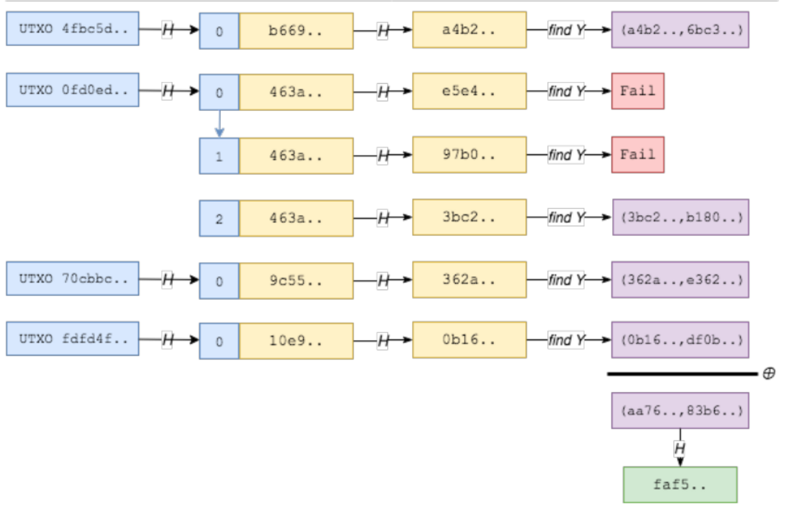

# UTXO commitment: Elliptic curve MultiSet Hash

## 引言

UTXO commitment(Unspent Transaction Output)未花费交易输出，是比特币交易生成及验证的一个核心概念。交易构成了一组链式结构，所有合法的比特币交易都可以追溯到前一个或多个交易的输出。

## 一、UTXO commitment：ECMH

根据参考【1】：https://zhuanlan.zhihu.com/p/38294218的简单统计： BCE 和BCH 主链截止到某个最近的区块时的 UTXO 数据。BCH 的主链截止高度534637，utxo集合有39922839个未花费的输出；BCE主链截止高度527687，utxo集合有51283037个为花费的输出。

由此可得，UTXO集合较大，其中的unspent output的量级在4000万到5000万这个量级之间，需要的存储也会超过2GB。同样UTXO集合本身也会随着新区块的产生不断变化，花费旧的output，生成新的unspent output。



相比较之下，Bitcoin模式下要启动一个全结点，需要下载从创世区块到最新区块所有的区块，这些区块的大小约为几百G（>>UTXO集合的几个G）

当前在验证tx合法性时，需要利用UTXO集合进行检查。完整的账本数据的存在是为了给UTXO提供担保。如果有其他的方式可以为UTXO集合提供担保或者承诺也许就不再需要存储整个的账本数据。怎么保证下载的UTXO集合和某个区块能够对上？这里就引入了UTXO Commitment（目前比特币没有这个东西）。就是把UTXO集合的摘要写到比特币的区块上。

UTXO commitment技术非常重要，它激活之后，可以保证网络中的节点只需要最近区块以及UTXO集合，就可以验证tx的合法性，而UTXO集合的合法性可以对比验证区块中的存储的commitment数据。

其实，中本聪在白皮书中就阐述了比特币的正确同步方式，就是只同步区块头+最后的余额信息（UTXO set，并通过UTXO commitment保证可靠性），再根据自己需要，同步最近一段时间的区块。

Elliptic Curve MultiSet Hash (ECMH)是一种基于椭圆曲线的哈希函数，它可以将多个元素（不同或重复）映射到一个固定长度的哈希值。

ECMH的基本思想是将多个元素先进行哈希，然后将哈希值映射到椭圆曲线上，最后将所有点相加得到一个新的点，并将该点的坐标表示作为哈希值输出。

根据上课PPT所讲：
- 同态或递增的多集散列函数
- hash({a}) + hash({b}) = hash({a,b})
- 一个空集映射到EC的无穷大点O
- 多集合中元素的顺序并不重要
- 重复的元素是可能的，{a}和{a，a}有不同的摘要。
- 要更新一个多集的摘要，只需要计算差值。
- 可以在任何椭圆曲线上构建
- 抗碰撞性依赖于ECDLP的困难程度
- 与SM2/ECDSA签名/验证的安全假设相同
- 收益：快速的节点同步，不需要从头做起

## 二、ECMH的实现思路
ECMH是一个32字节的值，它是为一组数据元素唯一确定地定义的，无论其顺序如何。

该模块允许为具有以下属性的集合计算加密安全哈希：

集合元素的顺序不影响哈希

可以将元素添加到集合中，而无需重新计算整个集合
或者从数学上来说，它是：

  交换：H（a，b）=H（b，a）

  结合：H（H（a，b，c）=H（a，H（b，c））

因此，它的行为类似于对单个元素的哈希进行异或运算，但没有异或的加密弱点。

该实现将hash值转换为secp256k1曲线上的点，该曲线用作Multiset。

然后使用该椭圆曲线类中的操作添加和删除Multiset Hash。这样进行映射的话Multiset Hash就具有了结合性和交换性（如上的数学表达）。

ECMH的安全性期望：可以防止碰撞攻击。

## 三、具体实现

### 定义椭圆曲线和哈希算法

```python
curve = ecdsa.SECP256k1
hash_func = hashlib.sha256
```

### 定义要Hash的元素

```python
elements = [b'hello', b'world']
```

### 哈希每个元素

```python
hashes = [hash_func(element).digest() for element in elements]
```

### 映射相加

```python
# 将哈希值映射到椭圆曲线上，并相加
point_sum = None
for hash_value in hashes:
    #注意Bicoin协议中用的是大端序
    x = int.from_bytes(hash_value, byteorder='big')
    y = curve.generator * x
    if point_sum is None:
        point_sum = y
    else:
        point_sum += y
```

### 输出哈希值

```python
hash_value = point_sum.x() 
print(hex(hash_value))
```

## 四、实现效果

最后经过ECMH算法后，将结果用16进制输出，得到一个32字节的值：


## 五、参考

【1】https://zhuanlan.zhihu.com/p/38294218

【2】https://blog.csdn.net/jason_cuijiahui/article/details/86711927

【3】https://eprint.iacr.org/2009/226.pdf

【4】PPT：20220606-eth-public