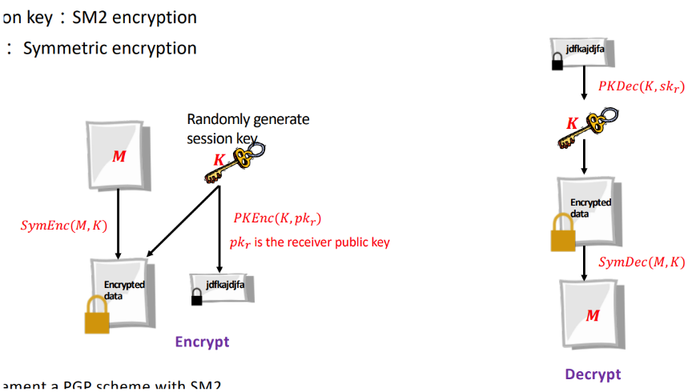
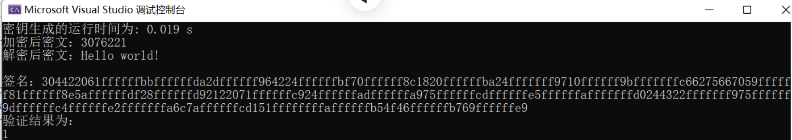
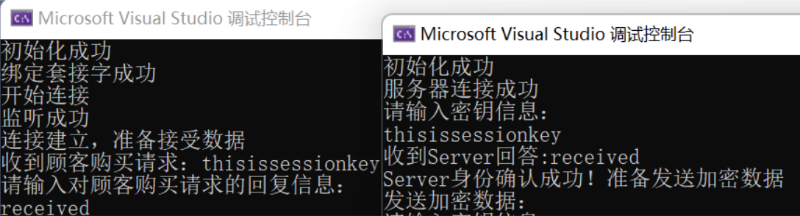
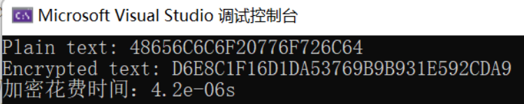

# Implement a PGP scheme with SM2
## 引言

PGP(Pretty Good Privacy)是一种加密通信协议和软件。PGP协议可以用于保护电子邮件、文件和磁盘等数据的机密性和完整性，以及验证数字签名。

## 一、实现原理
根据上课PPT所讲：



1. 会话密钥生成：随机生成会话密钥并用SM2的密钥交换协议进行密钥分发；

2. 加密会话密钥：利用SM2公钥加密算法加密会话密钥

3. 加密数据：利用对称加密算法进行加密数据

## 二、具体实现

1、首先随机生成公私钥对：

```c++
//生成密钥对
    sm2PrivateKey priv_key;

    //导出公钥
    sm2PublicKey pub_key = priv_key.CreatePublic();
```

SM2加解密算法以及数字签名的正确性验证：



2、之后为了实现密钥交换，我们建立了Client-Server的TCP通信框架：



3、在密钥交换之后，我们需要用对称加密方案对数据进行加密，这里我们调用国密SM4来加密数据：

原始数据：

```python
std::string plaintext = "Hello world!";
```

加密结果：



## 参考

PPT：20230401-sm2-public