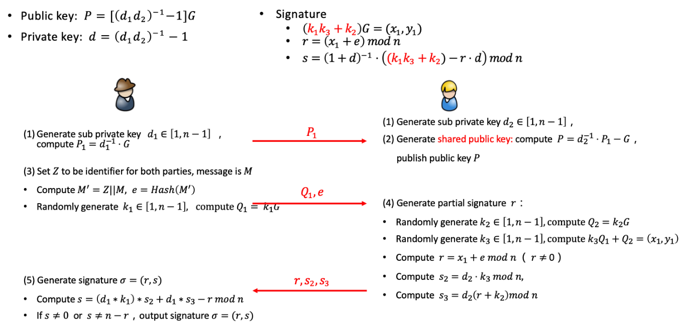
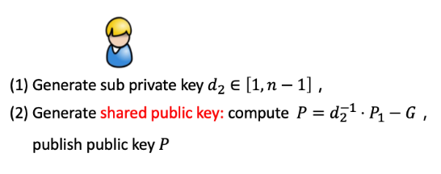
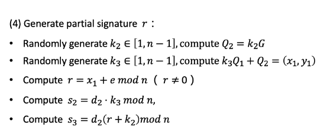
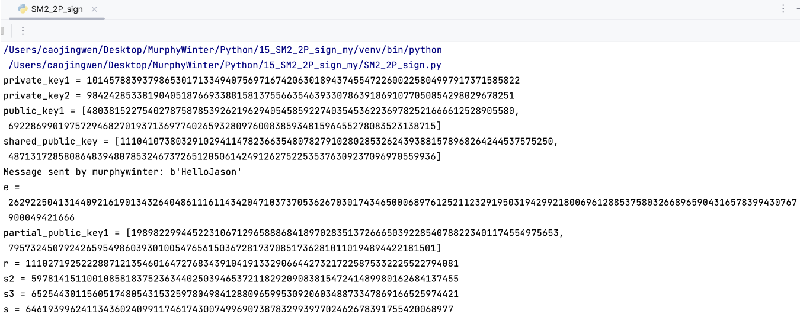

# implement sm2 2P sign with real network communication

## project简介

真实网络通信下SM2双方签名的实现。签名实现整体示意图：



## 具体实现

### 实验环境

基于pycharm编译器导入gmssl库后运行。

### SM2_2P_sign实现

#### 准备

##### 软件环境配置、参数初始化

###### 代码说明

导入自编写文件、库，初始化有限域的阶、椭圆曲线的阶和基本点、圆锥曲线相关参数，由MyFunc.py密钥生成函数生成公私钥对。

###### 代码呈现

```python
#设置椭圆曲线和有限域的阶
FIELD_ORDER = 0xFFFFFFFEFFFFFFFFFFFFFFFFFFFFFFFFFFFFFFFF00000000FFFFFFFFFFFFFFFF
CURVE_ORDER = 0xFFFFFFFEFFFFFFFFFFFFFFFFFFFFFFFF7203DF6B21C6052B53BBF40939D54123
POINT_X = 0x32C4AE2C1F1981195F9904466A39C9948FE30BBFF2660BE1715A4589334C74C7
POINT_Y = 0xBC3736A2F4F6779C59BDCEE36B692153D0A9877CC62A474002DF32E52139F0A0
BASE_POINT = (POINT_X, POINT_Y)

#设置椭圆曲线参数
CURVE_PARAM_A = 0xFFFFFFFEFFFFFFFFFFFFFFFFFFFFFFFFFFFFFFFF00000000FFFFFFFFFFFFFFFC
CURVE_PARAM_B = 0x28E9FA9E9D9F5E344D5A9E4BCF6509A7F39789F515AB8F92DDBCBD414D940E93

secret_key, public_key = MF.generate_key()      #调用MF.generate_key()生成密钥对
```

##### 计算消息的标识符ZA

###### 代码说明

定义函数calculate_ZA，实现对传递参数identifier、椭圆曲线参数a b、G点x y、公钥sk pk的拼接，继而由SM3算法对其进行哈希。

###### 代码呈现

```python
def calculate_ZA(identifier, a, b, x, y, sk, pk):
    entl = str(len(identifier.encode()) << 3)
    joint = entl + identifier + str(a) + str(b) + str(x) + str(y) + str(sk) + str(pk)
    joint_bytes = bytes(joint, encoding='utf-8')
    hash_value = sm3.sm3_hash(func.bytes_to_list(joint_bytes))
    return int(hash_value, 16)
```

#### 生成私钥private_key1、private_key2，计算public_key1

###### 流程展示


###### 代码思路

1. 由随机数生成器生成私钥private_key1、private_key2
2. 在发送方计算$public\_key1= private\_key1^{-1}*BASE\_POINT$
3. 将public_key1发送至接收方

###### 代码呈现

```python
if __name__ == '__main__':
    #生成私钥1、私钥2
    private_key1 = secrets.randbelow(CURVE_ORDER-1)
    private_key2 = secrets.randbelow(CURVE_ORDER-1)
    #生成私钥1、私钥2的乘法逆元
    private_key1_inverse = MF.calculate_inverse(private_key1, CURVE_ORDER)
    private_key2_inverse = MF.calculate_inverse(private_key2, CURVE_ORDER)
    public_key1 = MF.ECC_multiply(private_key1_inverse, BASE_POINT)     #计算公钥1
    print("private_key1 =", private_key1)
    print("private_key2 =", private_key2)
    print("public_key1 =", public_key1)
```

#### 生成共享公钥shared_public_key

###### 流程展示



###### 代码思路

接受方生成随机数private_key2后，计算$shared\_public\_key = private\_key2^{-1}*private\_key1-BASE\_POINT$。shared_public_key为共享公钥，需要公布。

###### 代码呈现

```python
partial_public_key = MF.ECC_multiply(private_key2_inverse, public_key1)     #计算部分公钥
    base_point_inverse = [POINT_X, -POINT_Y]
    shared_public_key = MF.ECC_add(partial_public_key, base_point_inverse)      #计算共享公钥
    print("shared_public_key =", shared_public_key)
```

#### 设置计算Z_A为双方标识符,计算e和partial_public_key1并发送至接收方

###### 流程展示


###### 代码思路

1. 在发送方，利用在准备阶段定义的calculate_ZA函数计算Z_A，并将其级联message哈希得到e。
2. 生成随机数random_number1，计算$partial\_public\_key1=random\_number1*BASE\_POINT$
3. 将e和partial_public_key1发送至接收方

###### 代码呈现

```python
identifier = "murphywinter"
    Z_A = calculate_ZA(identifier, CURVE_PARAM_A, CURVE_PARAM_B, POINT_X, POINT_Y, secret_key, public_key)      #计算标识符Z_A
    message = b'HelloJason'
    _message = b''.join([MF.to_byte(i) for i in [Z_A, message]])        #构造消息,将Z_A和消息合并为字节串
    print("Message sent by murphywinter:", message)
    e = int.from_bytes(MF.to_byte(sm3.sm3_hash(func.bytes_to_list(_message))), byteorder='big')     #将合并后的消息进行哈希,转换得整数e
    random_number1 = secrets.randbelow(CURVE_ORDER-1)
    partial_public_key1 = MF.ECC_multiply(random_number1, BASE_POINT)
    print("e =", e)
    print("partial_public_key1 =", partial_public_key1)
```

#### 计算部分签名r



###### 代码思路

1. 在接收方随机生成两个随机数random_number2、random_number3
2. 计算$partial\_public\_key2=random\_number2*BASE\_POINT$
3. 利用$partial\_public\_key2(combined\_public\_key[0]，y1)=partial\_public\_key3*partial\_public\_key1+partial\_public\_key2$。在combined_public_key[0]后与e相加得到r
4. 计算$s2=private\_key2 * random\_number2$,$s3=private\_key2 * (r + random\_number1)$
5. 将r，s2，s3发送至发送方

###### 代码呈现

```python
random_number2 = secrets.randbelow(CURVE_ORDER-1)
    partial_public_key2 = MF.ECC_multiply(random_number2, BASE_POINT)
    partial_public_key3 = MF.ECC_multiply(random_number2, partial_public_key1)      #计算部分公钥3:将随机数2与部分公钥1相乘。
    combined_public_key = MF.ECC_add(partial_public_key3, partial_public_key2)
    r = (combined_public_key[0] + e) % CURVE_ORDER
    print("r =", r)
    s2 = (private_key2 * random_number2) % CURVE_ORDER
    s3 = (private_key2 * (r + random_number1)) % CURVE_ORDER
    print("s2 =", s2)
    print("s3 =", s3)
```

#### 生成签名s=(r,s)

###### 流程展示


###### 代码思路

1. 发送方接收到r，s2，s3后，计算$s=private\_key1 * random\_number1 * s2 + private\_key1 * s3 - r$
2. 判断其是否不等于零、是否不等于$CURVE\_ORDER - r$
3. 输出（r，s）

###### 代码呈现

```python
s = (private_key1 * random_number1 * s2 + private_key1 * s3 - r) % CURVE_ORDER
    if s != 0 and s != CURVE_ORDER - r:
        print("s =", s)
```

### 输出结果展示

设定发送方为murphywinter，所发送的消息为HelloJason，则真实网络通信下SM2双方签名实现的输出结果如下所示：



### MyFunc实现

#### 初始化椭圆曲线参数和有限域阶

设置椭圆曲线和有限域的阶、椭圆曲线参数

```python
#设置椭圆曲线和有限域的阶
FIELD_ORDER = 0xFFFFFFFEFFFFFFFFFFFFFFFFFFFFFFFFFFFFFFFF00000000FFFFFFFFFFFFFFFF
CURVE_ORDER = 0xFFFFFFFEFFFFFFFFFFFFFFFFFFFFFFFF7203DF6B21C6052B53BBF40939D54123
POINT_X = 0x32C4AE2C1F1981195F9904466A39C9948FE30BBFF2660BE1715A4589334C74C7
POINT_Y = 0xBC3736A2F4F6779C59BDCEE36B692153D0A9877CC62A474002DF32E52139F0A0
BASE_POINT = (POINT_X, POINT_Y)

#设置椭圆曲线参数
CURVE_PARAM_A = 0xFFFFFFFEFFFFFFFFFFFFFFFFFFFFFFFFFFFFFFFF00000000FFFFFFFFFFFFFFFC
CURVE_PARAM_B = 0x28E9FA9E9D9F5E344D5A9E4BCF6509A7F39789F515AB8F92DDBCBD414D940E93
```

#### 构造SM2所需使用的数学函数

##### 基于扩展欧几里得算法求逆

```python
'''基于扩展欧几里得算法求逆'''
def calculate_inverse(a, b):
    if a == b:
        return (a, 1, 0)        #若相等,则直接返回
    else:
        flag = False
        c = [a]
        d = [b]
        e = []
        res = []
        #循环判断,直到res==0
        i = 0
        while not flag:
            e.append(d[i] // c[i])
            res.append(d[i] % c[i])
            d.append(c[i])
            c.append(res[i])
            i += 1
            if res[i-1] == 0:
                flag = True
        i -= 1
        res1 = [1]      #系数
        res2 = [0]      #系数
        res3 = c[i]     #公因子
        i -= 1
        num = i
        while i >= 0:
            res2.append(res1[num - i])
            res1.append(res2[num - i] - e[i] * res1[num - i])
            i -= 1
        if res3 == 1:
            return res1[-1] % b
        else:
            return -1
```

##### Tonelli-Shanks求解二次剩余

```python
'''Tonelli-Shanks求解二次剩余'''
def Tonelli_Shanks(y, p):
    #利用勒让德符号判断是否为二次剩余
    assert pow(y, (p - 1) // 2, p) == 1
    if p % 4 == 3:
        return pow(y, (p + 1) // 4, p)
    q = p - 1
    s = 0
    while q % 2 == 0:
        q = q // 2
        s += 1
    for t in range(2, p):
        if pow(t, (p - 1) // 2, p) == p - 1:
            c = pow(t, q, p)
            break
    r = pow(y, (q + 1) // 2, p)
    t = pow(y, q, p)
    m = s
    if t % p == 1:
        return r
    else:
        i = 0
        while t % p != 1:       #外层循环的判断条件
            temp = pow(t, 2**(i + 1), p)
            i += 1
            if temp % p == 1:
                b = pow(c, 2**(m - i - 1), p)
                r = r * b % p
                c = b * b % p
                t = t * c % p
                m = i
                i = 0       #每次内层循环结束后i值要更新为0
        return r
```

##### 椭圆曲线加法与乘法运算

基于上述函数，定义椭圆曲线上的加法、乘法运算。

在加法运算中，包含斜率存在、斜率不存在，两种情况。利用微分求解。

```python
#椭圆曲线加法运算
def ECC_add(a, b):
    #考虑是否存在0的情况
    if a == 0 and b == 0:
        return 0
    if a == 0:
        return b
    if b == 0:
        return a
    if a == b:
        #此时无法直接求斜率，需要借助微分
        k = (3 * a[0] ** 2 + CURVE_PARAM_A) * calculate_inverse(2 * a[1], FIELD_ORDER) % FIELD_ORDER
        res = (k ** 2 - 2 * a[0]) % FIELD_ORDER
        list1 = [res, (k * (a[0] - res) - a[1]) % FIELD_ORDER]
        return list1
    else:
        #保证大数在前
        if a[0] > b[0]:
            temp = a
            a = b
            b = temp
        #计算斜率
        k = (b[1] - a[1]) * calculate_inverse(b[0] - a[0], FIELD_ORDER) % FIELD_ORDER
        #依据椭圆曲线的计算规则进行计算
        res = (k ** 2 - a[0] - b[0]) % FIELD_ORDER
        list2 = [res, (k * (a[0] - res) - a[1]) % FIELD_ORDER]
        return list2
```

```python
#椭圆曲线乘法运算
def ECC_multiply(a, b):
    res = 0     #初始化res为无穷远点O
    a_bin = bin(a)[2:]      #将a转为二进制
    b_temp = b
    for i in reversed(range(len(a_bin))):
        if a_bin[i] == '1':
            res = ECC_add(res, b_temp)
        b_temp = ECC_add(b_temp, b_temp)
    return res
```

##### 基于secret库实现密钥生成函数

```python
'''基于secret库的密钥生成函数'''
def generate_key():
    private_key = int(secrets.token_hex(32), 16)
    public_key = ECC_multiply(private_key, BASE_POINT)
    return private_key, public_key
```

##### 变量类型转换函数

将变量转换为bytes类型

```python
'''变量类型转换函数'''
#转换为bytes，第二参数为字节数，可以为空白
def to_byte(x, size=None):
    if isinstance(x, int):
        if size is None:        #计算合适的字节数
            size = 0
            tmp = x >> 64
            while tmp:
                size += 8
                tmp >>= 64
            tmp = x >> (size << 3)
            while tmp:
                size += 1
                tmp >>= 8
        elif x >> (size << 3):      #指定的字节数不够则截取低位
            x &= (1 << (size << 3)) - 1
        return x.to_bytes(size, byteorder='big')
    elif isinstance(x, str):
        x = x.encode()
        if size is not None and len(x) > size:      #超过指定长度
            x = x[:size]         #截取左侧字节
        return x
    elif isinstance(x, bytes):
        if size is not None and len(x) > size:      #超过指定长度
            x = x[:size]         #截取左侧字节
        return x
    elif isinstance(x, tuple) and len(x) == 2 and type(x[0]) == type(x[1]) == int:
        #针对坐标形式(x, y)
        return to_byte(x[0], size) + to_byte(x[1], size)
    return bytes(x)

```

## 参考资料

<https://blog.csdn.net/qq_51999772/article/details/122642868>

<https://blog.csdn.net/qq_43339242/article/details/123221091>