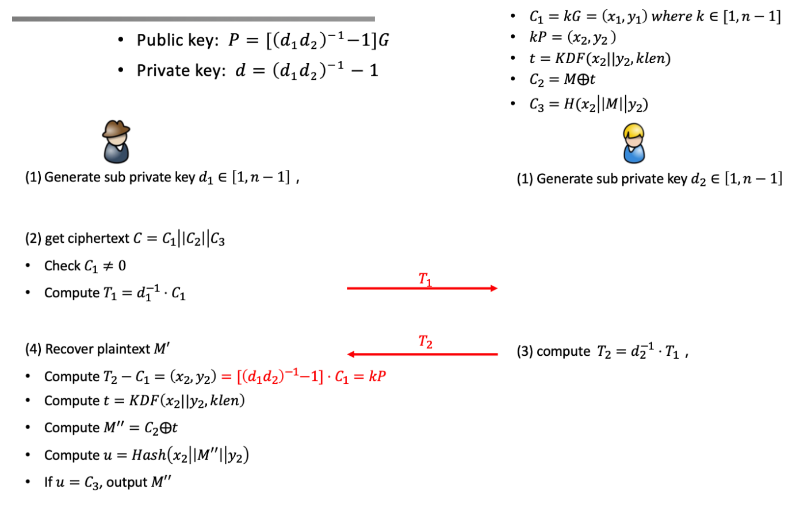
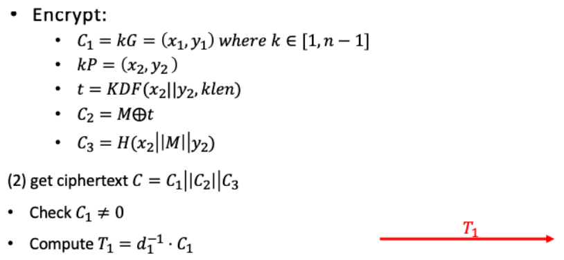
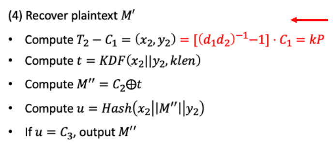
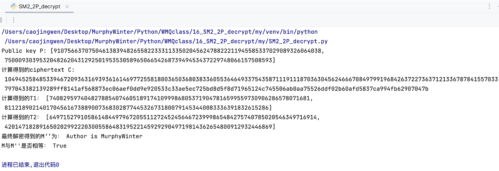

# implement sm2 2P decrypt with real network communication

## project简介



## 具体实现

### 实验环境

基于pycharm编译器导入MyFunc以及SM3后运行SM2_2P_decrypt。

### SM2_2P_decrypt实现

#### 准备

##### 软件环境配置、参数初始化

###### 代码说明

导入自编写文件：MyFunc和SM3、库：secrets和math，初始化有限域的阶、椭圆曲线的阶和基本点、圆锥曲线相关参数，由MyFunc.py密钥生成函数生成公私钥对。

###### 代码呈现

```python
import MyFunc
import secrets
import math
from SM3 import sm3_hash

'''设置有限域的阶以及椭圆曲线的阶'''
P1 = 0xFFFFFFFEFFFFFFFFFFFFFFFFFFFFFFFFFFFFFFFF00000000FFFFFFFFFFFFFFFF
P2 = 0xFFFFFFFEFFFFFFFFFFFFFFFFFFFFFFFF7203DF6B21C6052B53BBF40939D54123
X = 0x32C4AE2C1F1981195F9904466A39C9948FE30BBFF2660BE1715A4589334C74C7
Y = 0xBC3736A2F4F6779C59BDCEE36B692153D0A9877CC62A474002DF32E52139F0A0
G = (X, Y)

'''设置椭圆曲线参数'''
a = 0xFFFFFFFEFFFFFFFFFFFFFFFFFFFFFFFFFFFFFFFF00000000FFFFFFFFFFFFFFFC
b = 0x28E9FA9E9D9F5E344D5A9E4BCF6509A7F39789F515AB8F92DDBCBD414D940E93
```

##### 密钥生成函数

###### 代码思路

1. 将z转换为二进制
2. 迭代生成klen/256个128位的密钥片段
3. 连接密钥片段，并根据klen截取所需的位数，得到最终的密钥

###### 代码呈现

```python
def KDF(z, klen):       #klen:密钥长度
    ct=1
    k=''
    for _ in range(math.ceil(klen/256)):
        k=k+sm3_hash(hex(int(z+'{:032b}'.format(ct),2))[2:])        #迭代z,然后进行SM3哈希
        ct=ct+1
    #连接密钥片段，根据klen截取长度
    k='0'*((256-(len(bin(int(k,16))[2:])%256))%256)+bin(int(k,16))[2:]
    return k[:klen]
```

#### 公私钥d1、d2生成

###### 流程展示


###### 代码思路

在两方各自生成随机数d1、d2，基于原理：$P=[(d_1d_2)^{-1}-1]G\ ;\ d=(d_1d_2)^{-1}-1$ 计算公钥P。

###### 代码呈现

```python
'''Generate sub private key d1、d2'''
d1 = secrets.randbelow(P2-1)
d2 = secrets.randbelow(P2-1)
d1d2_ = MyFunc.calculate_inverse(d1 * d2, P1)
P = MyFunc.ECC_multiply(d1d2_ - 1, G)        #生成公钥
print('Public key P:',P)
```

#### 密文处理

###### 流程展示




###### 代码思路

1. 加密明文
2. 将C1、C2、C3级联得到ciphertext C
3. 若C1不为0，则计算T1
4. 将T1发送给另一方

###### 代码呈现

```python
'''get ciphertext C'''
#加密函数
def Encryt(M):
    M= '0' * ((4 - (len(bin(int(M.encode().hex(), 16))[2:]) % 4)) % 4) + bin(int(M.encode().hex(), 16))[2:]     #将明文转为二进制并填充
    klen = len(M)
    k = secrets.randbelow(P2-1)
    C1 =MyFunc.ECC_multiply(k,G)     #生成随机参数k对应的点C1
    [x2,y2] = MyFunc.ECC_multiply(k,P)       #生成中间点x2,y2
    x2, y2 = '{:0256b}'.format(x2), '{:0256b}'.format(y2)
    x2_y2 = x2+y2
    t = KDF(x2_y2,klen)     #基于密钥生成函数KDF生成密钥t
    C2 = ((klen//4)-len(hex(int(M,2)^int(t,2))[2:]))*'0'+hex(int(M,2)^int(t,2))[2:]
    C3_ = x2+M+y2
    C3 = sm3_hash(hex(int(C3_,2))[2:])      #SM3哈希计算密文C3
    return [C1,C2,C3]

M = 'Author is MurphyWinter'        #明文
[C1,C2,C3] = Encryt(M)
C = str(C1[0])+str(C1[1])+C2+C3     #将密文各部分组合为完整密文
print('计算得到的ciphertext C:',C)
if(C1 != 0):        #若C1不为0则继续解密
    d1_ = MyFunc.calculate_inverse(d1,P1)
    T1 = MyFunc.ECC_multiply(d1_,C1)
    print("计算得到的T1：",T1)
```

#### 计算T2

###### 流程展示


###### 代码思路

在另一方接收到T1后，计算T2并发送至密文获取方。

###### 代码呈现

```python
'''计算T2'''
d2_ = MyFunc.calculate_inverse(d2,P1)
T2 = MyFunc.ECC_multiply(d2_,T1)
print("计算得到的T2：",T2)
```

#### 恢复明文M_



###### 代码思路

1. 计算解密密钥k
2. 生成解密密钥t
3. 异或C2和t计算解密后的明文M_
4. 计算哈希值并比较，检验解密是否成功

###### 代码呈现

```python
'''恢复明文 M_'''
def decypt(C1,C2,C3):
    klen = len(C2)*4
    kP = MyFunc.ECC_multiply(d1d2_-1,C1)     #kP=(d1*d2-1)*C1
    [x2,y2] = kP
    x2, y2 = '{:0256b}'.format(x2), '{:0256b}'.format(y2)
    x2_y2 = x2+y2
    t = KDF(x2_y2,klen)     #生成解密密钥t
    M__ = '0' * (klen - len(bin(int(C2, 16) ^ int(t, 2))[2:])) + bin(int(C2, 16) ^ int(t, 2))[2:]
    u_ = x2+M__+y2
    u = sm3_hash(hex(int(u_,2))[2:])
    if(u == C3):
        M__ = hex(int(M__,2))[2:]
        M__ =str(bytes.fromhex(M__))
        M__ = '\n'.join(M__[2:-1].split('\\n'))
        print("最终解密得到的M‘’为：",M__)
        print("M与M''是否相等：", M == M__)
decypt(C1,C2,C3)
```

### 输出结果展示




### MyFunc实现

#### 初始化椭圆曲线参数和有限域阶

设置椭圆曲线和有限域的阶、椭圆曲线参数

```python
#设置椭圆曲线和有限域的阶
FIELD_ORDER = 0xFFFFFFFEFFFFFFFFFFFFFFFFFFFFFFFFFFFFFFFF00000000FFFFFFFFFFFFFFFF
CURVE_ORDER = 0xFFFFFFFEFFFFFFFFFFFFFFFFFFFFFFFF7203DF6B21C6052B53BBF40939D54123
POINT_X = 0x32C4AE2C1F1981195F9904466A39C9948FE30BBFF2660BE1715A4589334C74C7
POINT_Y = 0xBC3736A2F4F6779C59BDCEE36B692153D0A9877CC62A474002DF32E52139F0A0
BASE_POINT = (POINT_X, POINT_Y)

#设置椭圆曲线参数
CURVE_PARAM_A = 0xFFFFFFFEFFFFFFFFFFFFFFFFFFFFFFFFFFFFFFFF00000000FFFFFFFFFFFFFFFC
CURVE_PARAM_B = 0x28E9FA9E9D9F5E344D5A9E4BCF6509A7F39789F515AB8F92DDBCBD414D940E93
```

#### 构造SM2所需使用的数学函数

##### 基于扩展欧几里得算法求逆

```python
'''基于扩展欧几里得算法求逆'''
def calculate_inverse(a, b):
    if a == b:
        return (a, 1, 0)        #若相等,则直接返回
    else:
        flag = False
        c = [a]
        d = [b]
        e = []
        res = []
        #循环判断,直到res==0
        i = 0
        while not flag:
            e.append(d[i] // c[i])
            res.append(d[i] % c[i])
            d.append(c[i])
            c.append(res[i])
            i += 1
            if res[i-1] == 0:
                flag = True
        i -= 1
        res1 = [1]      #系数
        res2 = [0]      #系数
        res3 = c[i]     #公因子
        i -= 1
        num = i
        while i >= 0:
            res2.append(res1[num - i])
            res1.append(res2[num - i] - e[i] * res1[num - i])
            i -= 1
        if res3 == 1:
            return res1[-1] % b
        else:
            return -1
```

##### Tonelli-Shanks求解二次剩余

```python
'''Tonelli-Shanks求解二次剩余'''
def Tonelli_Shanks(y, p):
    #利用勒让德符号判断是否为二次剩余
    assert pow(y, (p - 1) // 2, p) == 1
    if p % 4 == 3:
        return pow(y, (p + 1) // 4, p)
    q = p - 1
    s = 0
    while q % 2 == 0:
        q = q // 2
        s += 1
    for t in range(2, p):
        if pow(t, (p - 1) // 2, p) == p - 1:
            c = pow(t, q, p)
            break
    r = pow(y, (q + 1) // 2, p)
    t = pow(y, q, p)
    m = s
    if t % p == 1:
        return r
    else:
        i = 0
        while t % p != 1:       #外层循环的判断条件
            temp = pow(t, 2**(i + 1), p)
            i += 1
            if temp % p == 1:
                b = pow(c, 2**(m - i - 1), p)
                r = r * b % p
                c = b * b % p
                t = t * c % p
                m = i
                i = 0       #每次内层循环结束后i值要更新为0
        return r
```

##### 椭圆曲线加法与乘法运算

基于上述函数，定义椭圆曲线上的加法、乘法运算。

在加法运算中，包含斜率存在、斜率不存在，两种情况。利用微分求解。

```python
#椭圆曲线加法运算
def ECC_add(a, b):
    #考虑是否存在0的情况
    if a == 0 and b == 0:
        return 0
    if a == 0:
        return b
    if b == 0:
        return a
    if a == b:
        #此时无法直接求斜率，需要借助微分
        k = (3 * a[0] ** 2 + CURVE_PARAM_A) * calculate_inverse(2 * a[1], FIELD_ORDER) % FIELD_ORDER
        res = (k ** 2 - 2 * a[0]) % FIELD_ORDER
        list1 = [res, (k * (a[0] - res) - a[1]) % FIELD_ORDER]
        return list1
    else:
        #保证大数在前
        if a[0] > b[0]:
            temp = a
            a = b
            b = temp
        #计算斜率
        k = (b[1] - a[1]) * calculate_inverse(b[0] - a[0], FIELD_ORDER) % FIELD_ORDER
        #依据椭圆曲线的计算规则进行计算
        res = (k ** 2 - a[0] - b[0]) % FIELD_ORDER
        list2 = [res, (k * (a[0] - res) - a[1]) % FIELD_ORDER]
        return list2
```

```python
#椭圆曲线乘法运算
def ECC_multiply(a, b):
    res = 0     #初始化res为无穷远点O
    a_bin = bin(a)[2:]      #将a转为二进制
    b_temp = b
    for i in reversed(range(len(a_bin))):
        if a_bin[i] == '1':
            res = ECC_add(res, b_temp)
        b_temp = ECC_add(b_temp, b_temp)
    return res
```

##### 基于secret库实现密钥生成函数

```python
'''基于secret库的密钥生成函数'''
def generate_key():
    private_key = int(secrets.token_hex(32), 16)
    public_key = ECC_multiply(private_key, BASE_POINT)
    return private_key, public_key
```

##### 变量类型转换函数

将变量转换为bytes类型

```python
'''变量类型转换函数'''
#转换为bytes，第二参数为字节数，可以为空白
def to_byte(x, size=None):
    if isinstance(x, int):
        if size is None:        #计算合适的字节数
            size = 0
            tmp = x >> 64
            while tmp:
                size += 8
                tmp >>= 64
            tmp = x >> (size << 3)
            while tmp:
                size += 1
                tmp >>= 8
        elif x >> (size << 3):      #指定的字节数不够则截取低位
            x &= (1 << (size << 3)) - 1
        return x.to_bytes(size, byteorder='big')
    elif isinstance(x, str):
        x = x.encode()
        if size is not None and len(x) > size:      #超过指定长度
            x = x[:size]         #截取左侧字节
        return x
    elif isinstance(x, bytes):
        if size is not None and len(x) > size:      #超过指定长度
            x = x[:size]         #截取左侧字节
        return x
    elif isinstance(x, tuple) and len(x) == 2 and type(x[0]) == type(x[1]) == int:
        #针对坐标形式(x, y)
        return to_byte(x[0], size) + to_byte(x[1], size)
    return bytes(x)

```

## 参考资料

<https://blog.csdn.net/qq_33439662/article/details/121635423>

<https://blog.csdn.net/qq_33439662/article/details/122590298>

<https://blog.csdn.net/qq_51999772/article/details/122642868>