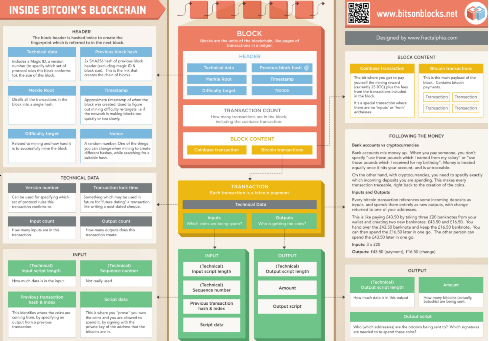
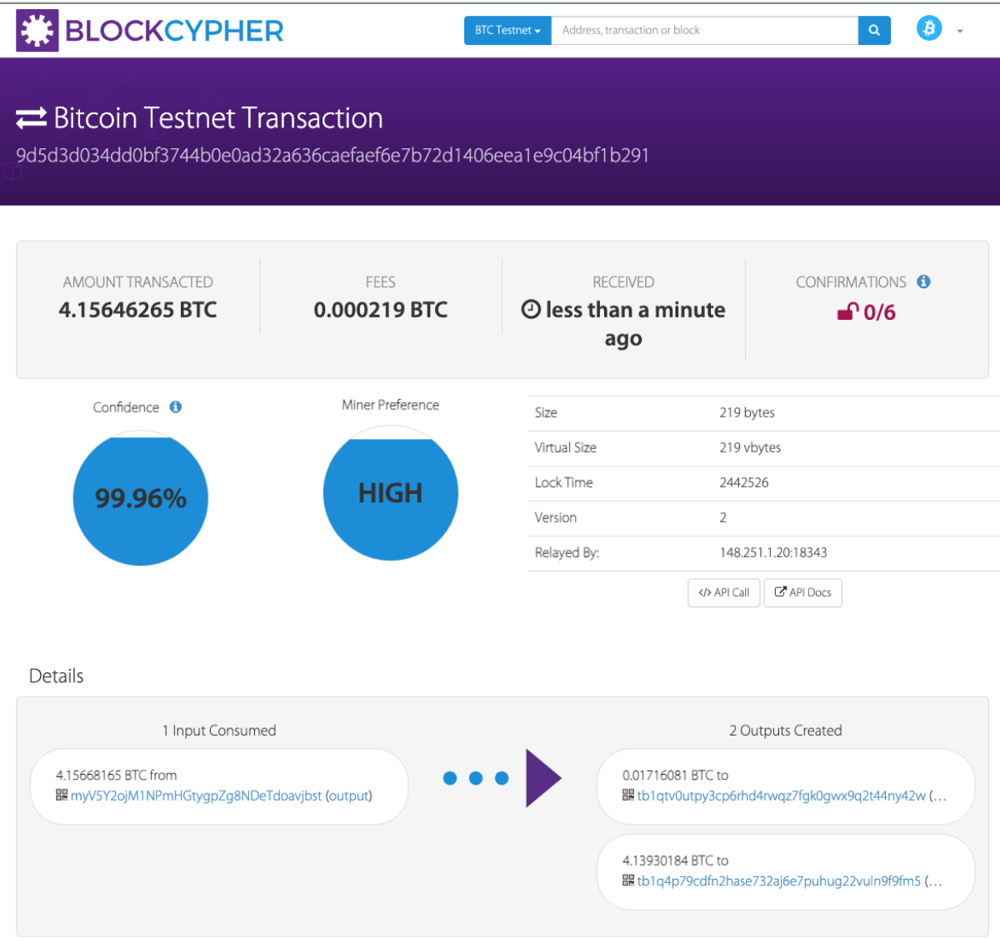

# send a tx on Bitcoin testnet, and parse the tx data down to every bit, better write script yourself

## project简介

### 项目简介：

根据课件内容，区块包含的信息如下所示：



据此实现后文对交易信息的分析。

### 实现情况：

本project先基于BlockCypher Testnet Explorer中的一个交易进行分析，然后据此基于testnet3测试网发送交易并解析交易数据，完成实验要求。

## 给定交易分析

### 选取交易

利用网站提供的API，选取下述交易：



#### 总体分析

由上图可知；本次交易共有一笔输入、两笔输出。其中含有本次交易中的哈希值、版本号、地址，如下所示：

> **哈希值：**
>
> 9d5d3d034dd0bf3744b0e0ad32a636caefaef6e7b72d1406eea1e9c04bf1b291
>
> **版本号：**
>
> 2
>
> **地址：**
>
> - input：myV5Y2ojM1NPmHGtygpZg8NDeTdoavjbst
> - output1：tb1qtv0utpy3cp6rhd4rwqz7fgk0gwx9q2t44ny42w
> - output2：tb1q4p79cdfn2hase732aj6e7puhug22vuln9f9fm5

### API call

该json对象包含该笔比特币交易的详细信息：

```json
{
  "block_height": -1,
  "block_index": -1,
  "hash": "9d5d3d034dd0bf3744b0e0ad32a636caefaef6e7b72d1406eea1e9c04bf1b291",
  "hex": "02000000015e803173a7c03ba13c0a70a6c05be98f56cd0ee0e060a2bebe6ffa1eca230abc000000006a47304402200bec0aaafca3d4b49e4608b6f6f13b6b0b8f8cc0350a5bfcb05fb8bc363bf22402205db368be82d9a89344f7464e1c86418a53f49fe9b43513981caad62cc82186a7012103acad2a738158148a42f143e974b8dd62602230df6f197ba0a83cfc1b63023ac6fdffffff02712f1a00000000001600145b1fc58491c0743bb6a37005e4a2cf438c502975c812ac1800000000160014a87c5c353355fb0cfa2aecb59f0797e214a673f31e452500",
  "addresses": [
    "myV5Y2ojM1NPmHGtygpZg8NDeTdoavjbst",
    "tb1q4p79cdfn2hase732aj6e7puhug22vuln9f9fm5",
    "tb1qtv0utpy3cp6rhd4rwqz7fgk0gwx9q2t44ny42w"
  ],
  "total": 415646265,
  "fees": 21900,
  "size": 219,
  "vsize": 219,
  "preference": "high",
  "relayed_by": "148.251.1.20:18343",
  "received": "2023-07-19T01:55:47.58Z",
  "ver": 2,
  "lock_time": 2442526,
  "double_spend": false,
  "vin_sz": 1,
  "vout_sz": 2,
  "opt_in_rbf": true,
  "confirmations": 0,
  "inputs": [
    {
      "prev_hash": "bc0a23ca1efa6fbebea260e0e00ecd568fe95bc0a6700a3ca13bc0a77331805e",
      "output_index": 0,
      "script": "47304402200bec0aaafca3d4b49e4608b6f6f13b6b0b8f8cc0350a5bfcb05fb8bc363bf22402205db368be82d9a89344f7464e1c86418a53f49fe9b43513981caad62cc82186a7012103acad2a738158148a42f143e974b8dd62602230df6f197ba0a83cfc1b63023ac6",
      "output_value": 415668165,
      "sequence": 4294967293,
      "addresses": [
        "myV5Y2ojM1NPmHGtygpZg8NDeTdoavjbst"
      ],
      "script_type": "pay-to-pubkey-hash",
      "age": 0
    }
  ],
  "outputs": [
    {
      "value": 1716081,
      "script": "00145b1fc58491c0743bb6a37005e4a2cf438c502975",
      "addresses": [
        "tb1qtv0utpy3cp6rhd4rwqz7fgk0gwx9q2t44ny42w"
      ],
      "script_type": "pay-to-witness-pubkey-hash"
    },
    {
      "value": 413930184,
      "script": "0014a87c5c353355fb0cfa2aecb59f0797e214a673f3",
      "addresses": [
        "tb1q4p79cdfn2hase732aj6e7puhug22vuln9f9fm5"
      ],
      "script_type": "pay-to-witness-pubkey-hash"
    }
  ]
}
```

下面对其含有的信息进行说明：

### 交易信息：

- `block_height`: 交易所在的区块高度，此处 -1 表示该交易尚未被确认
- `block_index`: 交易在区块中的索引号，此处 -1 表示该交易尚未被确认
- `hash`: 交易哈希值，用于唯一标识该笔交易
- `hex`: 交易的十六进制表示形式
- `addresses`: 包含在交易中的地址列表，该笔交易包含一个输入、两个输出，因而涉及到三个地址
- `total`: 交易的总输出金额，单位为satoshis，这里为415646265 satoshis
- `fees`: 交易费用，该交易中发送方支付的费用，单位为satoshis，这里为21900 satoshis
- `size`和 `vsize`: 交易的大小和虚拟大小，以字节为单位，这两个值相同，都为219字节
- `preference`: 交易优先级，这里为"high"
- `relayed_by`: 交易被传输的节点IP地址和端口号，这里为"148.251.1.20:18343"
- `received`:交易接收时间，这里为"2023-07-19T01:55:47.58Z"
- `ver`: 交易版本号，这里为2
- `lock_time`: 交易锁定时间，这里为2442526
- `double_spend`: 是否双重花费，这里为false，表示未双花。
- `vin_sz`: 输入数量，这里为1
- `vout_sz`: 输出数量，这里为2
- `opt_in_rbf`: 是否支持替换-通过-费用，这里为true表示支持
- `confirmations`: 确认次数，这里为0，表示该交易尚未被确认

### 交易输入：

- 上一笔交易哈希：`prev_hash`："bc0a23ca1efa6fbebea260e0e00ecd568fe95bc0a6700a3ca13bc0a77331805e"
- 上一笔交易输出索引号`output_index`：0
- 脚本`script`："47304402200bec0aaafca3d4b49e4608b6f6f13b6b0b8f8cc0350a5bfcb05fb8bc363bf22402205db368be82d9a89344f7464e1c86418a53f49fe9b43513981caad62cc82186a7012103acad2a738158148a42f143e974b8dd62602230df6f197ba0a83cfc1b63023ac6"
- 输出金额`output_value`：415668165 satoshis
- 输入序列号`sequence`：4294967293
- 地址`addresses`："myV5Y2ojM1NPmHGtygpZg8NDeTdoavjbst"
- 脚本类型`script_type`："pay-to-pubkey-hash"
- 年龄`age`：0

### 交易输出：

- 金额`value`：1716081 satoshis
- 脚本`script`："00145b1fc58491c0743bb6a37005e4a2cf438c502975"
- 地址`addresses`："tb1qtv0utpy3cp6rhd4rwqz7fgk0gwx9q2t44ny42w"
- 脚本类型`script_type`："pay-to-witness-pubkey-hash"
- 金额`value`：413930184 satoshis
- 脚本`script`："0014a87c5c353355fb0cfa2aecb59f0797e214a673f3"
- 地址`addresses`："tb1q4p79cdfn2hase732aj6e7puhug22vuln9f9fm5"
- 脚本类型`script_type`："pay-to-witness-pubkey-hash"

上述即为本笔交易的信息，具体包括交易信息、输入、输出、费用、时间戳等。

## 发送解析交易实现

### 测试脚本编写

#### 编写思路

1. 导入库：导入所需的Ruby标准库（`open-uri`、`net/http`、`net/https`、`json`）和`bitcoin`库
2. 设置比特币测试网络：由`Bitcoin.network = :testnet3`设置使用testnet3测试网。
3. 获取原始交易数据：`get_response`函数实现从指定的区块链浏览器API获取特定交易的原始数据。
4. 构建新的比特币交易：`build_transaction`函数基于`Bitcoin::Builder`模块构建新的比特币交易。它创建新交易，输入为前一笔交易的输出，并使用提供的私钥对交易签名。
5. 转换字符串类型：`bin_to_hex`函数实现将字节字符串转换为十六进制字符串。
6. 设置交易的公钥、私钥、收款地址。
7. 获取之前交易的原始数据并解析：通过调用`get_response`函数获取之前交易的原始数据，并通过`Bitcoin::P::Tx`类将其解析为比特币交易对象。
8. 获取之前交易的输出金额：从解析后的之前交易中获取指定输出的金额。
9. 构建新的比特币交易：调用`build_transaction`函数创建新的比特币交易，并设置发送到的地址、金额等信息。
10. 打印新交易的十六进制数据：通过调用`bin_to_hex`函数将新交易的序列化数据转换为十六进制字符串，并打印输出。

#### 代码呈现

```ruby
require 'open-uri'
require 'net/http'
require 'net/https'
require 'json'

require 'bitcoin'

# 设置比特币测试网的网络
Bitcoin.network = :testnet3

def get_response(prev_tx)
  # 获取之前交易的原始数据
  # prev_tx: 之前交易的ID（十六进制字符串）
  # 返回：原始交易数据（字符串）
  url = "https://testnet.blockexplorer.com/api/rawtx/#{prev_tx}"
  uri = URI(url)
  response = Net::HTTP.get(uri)
  response = JSON.parse(response)
  response = response['rawtx'].to_s
  return response
end

def build_transaction(prev_tx, prev_out_index, key, satoshi_to_spend, addr, message)
  # 构建新的比特币交易
  # prev_tx: 之前交易的ID（十六进制字符串）
  # prev_out_index: 输出序号，指定使用之前交易的哪个输出
  # key: 用于签名的公钥
  # satoshi_to_spend: 要花费的金额（单位：satoshi）
  # addr: 收款地址
  # message: 附加信息
  # 返回：新的比特币交易对象（CTransaction）
  include Bitcoin::Builder

  new_tx = build_tx do |t|
    t.input do |i|
      i.prev_out prev_tx
      i.prev_out_index prev_out_index
      i.signature_key key
    end
    t.output do |o|
      o.value satoshi_to_spend
      o.script {|s| s.type :address; s.recipient addr }
    end
  end
  puts ""
  puts "--- new tx ---"
  puts new_tx.to_json
  return new_tx
end

def bin_to_hex(s)
  # 将字节字符串转换为十六进制字符串
  # s: 字节字符串
  # 返回：十六进制字符串
  s.unpack('H*').first
end

bitcoin_key_1_pub = "0367e6251a89c5afc1212c3e2169866ccfe9d6059a4cfc15dc139b534b974fd7ca"
bitcoin_key_1_priv = "*****24c56528becd02d23076123a2edc2f3cf52c3c0202178c1b7fa9ac*****"
bitcoin_key_1_addr = "mxz4hu6JrTHevn22W4GDVjS3ko9MwXuHND"

# 之前交易的ID，其中有一个输出是你的地址
prev_tx_1 = "427138ed5f2443fbfbf8065e990f1bf9ce0236e14376e8abca0b2876eabca653"

# 要使用的输出序号
prev_out_index = 1

# 0.5 BTC 单位：satoshi
btc_to_spend = 0.5
satoshi_to_spend = btc_to_spend * 100000000

bitcoin_key_2_pub = "02989d0578f715a1980d4d6e968bcba487077e74aaf8a219d11ee4384ea1fc1eda"
bitcoin_key_2_priv = "*****cb521a27f9782cc503b461bf5c6b470469ca00ba1d7dc26f4ab61b*****"
bitcoin_key_2_addr = "n4SYP6TJyK7pUouW65fnC1hDBrbb7Za8RR"

# 从任意位置获取交易数据并解析它
response = get_response(prev_tx_1)
$prev_tx = Bitcoin::P::Tx.new(response.htb)
prev_tx = $prev_tx

tx_value = prev_tx.outputs[prev_out_index].value
puts "tx_value: #{tx_value}"

key = Bitcoin::Key.new(bitcoin_key_1_priv, bitcoin_key_1_pub)
tx = build_transaction(prev_tx, prev_out_index, key, satoshi_to_spend, bitcoin_key_2_addr, "hello")

puts ""
puts "--- bin_to_hex ---"
puts bin_to_hex(tx.to_payload)
```

#### 运行结果

运行上述代码，得到的交易数据如下所示：

```ruby
➜  examples git:(master) ✗ ruby sandbox.rb

tx_value: 75972791
/Users/glaksmono/.rvm/gems/ruby-2.4.2/gems/bitcoin-ruby-0.0.18/lib/bitcoin/script.rb:281: warning: constant ::Fixnum is deprecated
/Users/glaksmono/.rvm/gems/ruby-2.4.2/gems/bitcoin-ruby-0.0.18/lib/bitcoin/script.rb:455: warning: constant ::Fixnum is deprecated

--- new tx ---
/Users/glaksmono/.rvm/gems/ruby-2.4.2/gems/bitcoin-ruby-0.0.18/lib/bitcoin/script.rb:261: warning: constant ::Fixnum is deprecated
{
  "hash":"88217866a40829f144e2d2c19b2e506812ae013d08d9335ce8fa839582f1b18e",
  "ver":1,
  "vin_sz":1,
  "vout_sz":1,
  "lock_time":0,
  "size":191,
  "in":[
    {
      "prev_out":{
        "hash":"427138ed5f2443fbfbf8065e990f1bf9ce0236e14376e8abca0b2876eabca653",
        "n":1
      },
      "scriptSig":"304402201cf2d99b7f10c71a1c77ae629ec134a3f255c0027f47815aff3e43d500e6da46022008409ea148d6cce6876910c7a7218b8197c3a827a6a7bf3d5f064a3ed3a0616701 0367e6251a89c5afc1212c3e2169866ccfe9d6059a4cfc15dc139b534b974fd7ca"
    }
  ],
  "out":[
    {
      "value":"0.50000000",
      "scriptPubKey":"OP_DUP OP_HASH160 fb75447d6038b05bb736e5b05f18a3c9da2b34db OP_EQUALVERIFY OP_CHECKSIG"
    }
  ]
}

--- bin_to_hex ---
010000000153a6bcea76280bcaabe87643e13602cef91b0f995e06f8fbfb43245fed387142010000006a47304402201cf2d99b7f10c71a1c77ae629ec134a3f255c0027f47815aff3e43d500e6da46022008409ea148d6cce6876910c7a7218b8197c3a827a6a7bf3d5f064a3ed3a0616701210367e6251a89c5afc1212c3e2169866ccfe9d6059a4cfc15dc139b534b974fd7caffffffff0180f0fa02000000001976a914fb75447d6038b05bb736e5b05f18a3c9da2b34db88ac00000000
```

#### 结果分析

由上述输出结果可知：

##### 交易哈希 `hash` ：

1. 版本号 `ver` ：1
2. 输入数量 `vin_sz` ：1
3. 输出数量 `vout_sz` ：1
4. 锁定时间 `lock_time` ：0
5. 交易大小 `size` ：191字节

##### 输入 `in` ：

1. 上一笔交易 `prev_out hash` ：427138ed5f2443fbfbf8065e990f1bf9ce0236e14376e8abca0b2876eabca653
2. 上一笔交易输出索引号 `n` ：1
3. 脚本签名 `scriptSig` ：304402201cf2d99b7f10c71a1c77ae629ec134a3f255c0027f47815aff3e43d500e6da46022008409ea148d6cce6876910c7a7218b8197c3a827a6a7bf3d5f064a3ed3a0616701 0367e6251a89c5afc1212c3e2169866ccfe9d6059a4cfc15dc139b534b974fd7ca

##### 输出 `out` ：

1. 价值 `value` ：0.50000000 BTC
2. 公钥脚本 `scriptPubKey` ：OP_DUP OP_HASH160 fb75447d6038b05bb736e5b05f18a3c9da2b34db OP_EQUALVERIFY OP_CHECKSIG

##### 十六进制格式的交易数据： 

010000000153a6bcea76280bcaabe87643e13602cef91b0f995e06f8fbfb43245fed387142010000006a47304402201cf2d99b7f10c71a1c77ae629ec134a3f255c0027f47815aff3e43d500e6da46022008409ea148d6cce6876910c7a7218b8197c3a827a6a7bf3d5f064a3ed3a0616701210367e6251a89c5afc1212c3e2169866ccfe9d6059a4cfc15dc139b534b974fd7caffffffff0180f0fa02000000001976a914fb75447d6038b05bb736e5b05f18a3c9da2b34db88ac00000000

## 参考

<https://live.blockcypher.com/btc-testnet/tx/9d5d3d034dd0bf3744b0e0ad32a636caefaef6e7b72d1406eea1e9c04bf1b291/>