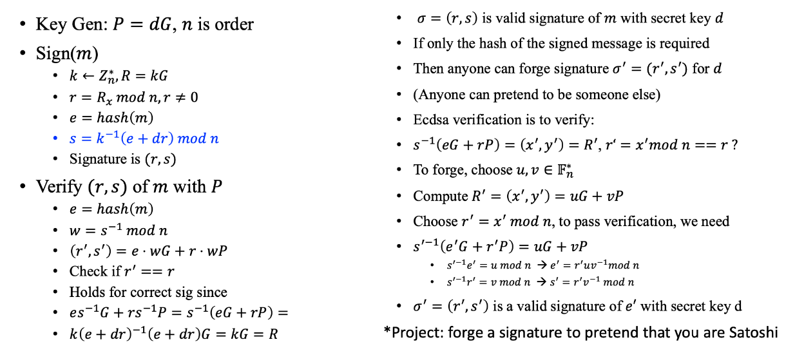
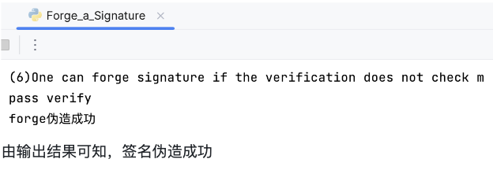

# forge a signature to pretend that you are Satoshi

## Project简介

在ECDSA未检查签名消息时伪造签名的整体过程如下所示：



基于上述签名伪造的原理，现伪造签名冒充中本聪。导入MyFunc文件后，运行Forge_a_Signature文件即可

## 具体实现

### Forge_a_Signature实现

#### 椭圆曲线参数设置

###### 代码功能

导入必要的库，设置有限域、椭圆曲线的阶、参数

###### 代码功能

```python
import MyFunc
import secrets
from hashlib import sha256

'''设置有限域的阶以及椭圆曲线的阶'''
FIELD_ORDER = 0xFFFFFFFEFFFFFFFFFFFFFFFFFFFFFFFFFFFFFFFF00000000FFFFFFFFFFFFFFFF
CURVE_ORDER = 0xFFFFFFFEFFFFFFFFFFFFFFFFFFFFFFFF7203DF6B21C6052B53BBF40939D54123
POINT_X = 0x32C4AE2C1F1981195F9904466A39C9948FE30BBFF2660BE1715A4589334C74C7
POINT_Y = 0xBC3736A2F4F6779C59BDCEE36B692153D0A9877CC62A474002DF32E52139F0A0
BASE_POINT = (POINT_X, POINT_Y)

'''设置椭圆曲线参数'''
CURVE_PARAM_A = 0xFFFFFFFEFFFFFFFFFFFFFFFFFFFFFFFFFFFFFFFF00000000FFFFFFFFFFFFFFFC
CURVE_PARAM_B = 0x28E9FA9E9D9F5E344D5A9E4BCF6509A7F39789F515AB8F92DDBCBD414D940E93
```

#### 公私钥对生成

###### 代码功能

调用generate_key函数生成公私钥对sk、pk

###### 代码展示

```python
sk,pk = MyFunc.generate_key()
```

#### 签名函数

##### Sig(private_key, mes, k)

###### 代码功能

生成ECDSA签名：使用私钥对消息进行签名，生成一对数字 (r, s)，其中 r 是椭圆曲线上的一个点的 x 坐标，而 s 是根据随机数 k 和私钥生成的一个数字。其具体实现细节如下所示：

1. 计算消息的哈希值 `hash`，通过 SHA-256 哈希算法对消息 `mes` 进行哈希运算，并将结果转换为整数
2. 使用随机数 `k` 与基本点 `BASE_POINT` 进行椭圆曲线上的点乘法运算，得到一个新的点 `G1`
3. 将 `G1` 的 x 坐标 `G1[0]` 取模 `FIELD_ORDER`，将结果添加到 `res` 列表中，该值是签名的一部分
4. 利用计算随机数的逆元函数 `MyFunc.calculate_inverse(k, CURVE_ORDER)`，将 `k` 的逆元与 `(hash + res[0] * private_key)` 的乘积取模 `CURVE_ORDER`，将结果添加到 `res` 列表中，该结果同样是签名的一部分
5. `res` 列表作为签名结果返回

###### 代码展示

```python
'''利用私钥进行签名'''
def Sig(private_key, mes,k):
    res = []
    hash = int(sha256(mes.encode('utf-8')).hexdigest(),16)
    G1 = MyFunc.ECC_multiply(k, BASE_POINT)
    res.append(G1[0] % FIELD_ORDER)
    res.append(MyFunc.calculate_inverse(k, CURVE_ORDER) * (hash + res[0] * private_key) % CURVE_ORDER)
    return res
```

##### Leaking_k(mes, r, s)

###### 代码功能

如果随机数k泄露，会导致私钥d泄露。则函数根据给定的消息、签名中的r、s，计算并输出私钥d

1. 计算消息的哈希值 `e`，通过 SHA-256 哈希算法对消息 `mes` 进行哈希运算，并将结果转换为整数
2. 计算 `r` 的逆元 `r_`，用于后续的计算
3. 通过泄露的私钥 `k`，根据 `r_*(k*s-e)` 计算新值 `d`
4. 将计算得到的 `d` 打印输出

###### 代码展示

```python
def Leaking_k(mes,r,s):
    e = int(sha256(mes.encode('utf-8')).hexdigest(), 16)
    r_ = MyFunc.calculate_inverse(r, CURVE_ORDER) % CURVE_ORDER
    d = r_*(k*s-e) % CURVE_ORDER
    print("(1)pitfalls1:Leaking k leads to leaking of d ")
    print("d:",d)
```

##### Reuseing_k(sk1, mes1, mes2)

###### 代码功能

如果同一个随机数k被多次使用，会导致私钥d泄漏。函数使用两个不同的消息分别生成两个签名，然后推导出对方的私钥d：

1. 使用 `Sig` 函数对两个消息 `mes1` 和 `mes2` 分别进行签名，得到对应的签名值 `r1, s1` 和 `r2, s2`
2. 分别计算消息 `mes1` 和 `mes2` 的哈希值：`e1` 、 `e2`
3. 计算 `se`= `s1 * e2 - s2 * e1` ，`sr1`= `s2 * r1 - s1 * r2`，取模 `CURVE_ORDER`，计算sr1` 的逆元：`sr1_` 
4. 通过 `d = (se * sr1_) % CURVE_ORDER` 计算出泄露的私钥 `d`
5. 打印输出泄露出的私钥 `d`，并检查泄露出的私钥 `d` 是否与签名时使用的私钥 `sk1` 相等

###### 代码展示

```python
''' Reusing k leads to leaking of d'''
def Reuseing_k(sk1, mes1, mes2):
    print("(2)Reusing k leads to leaking of d")
    [r1,s1] = Sig(sk1, mes1,k)
    [r2,s2] = Sig(sk1,mes2,k)
    print('签名时使用的私钥d:',sk1)

    e1 = int(sha256(mes1.encode('utf-8')).hexdigest(),16)
    e2 = int(sha256(mes2.encode('utf-8')).hexdigest(),16)
    se = s1*e2 - s2*e1
    sr1 = s2*r1-s1*r2 % CURVE_ORDER
    sr1_ = MyFunc.calculate_inverse(sr1,CURVE_ORDER)
    d = (se *sr1_) % CURVE_ORDER
    print('在重复使用k后计算出泄露的私钥d‘=',d)
    print('泄露出的私钥d‘与签名所使用的的d是否相等：',d == sk1)
```

##### reusing_k_by_2(sk11, sk22, mes11, mes22)

###### 代码功能

两个独立的用户使用相同的随机数k会导致彼此私钥d的泄露。

1. 两个用户分别使用 `Sig` 函数使用相同的 `k` 值，对各自的消息 `mes11` 、 `mes22` 进行签名，对应的签名值为 `r, s11` 、 `r, s22`
2. 计算两个用户彼此推导对方私钥的过程：
   1. 对于 user1 推导 user2 的私钥 `d`：
      1. 计算 `se = s22 * e11 - s11 * e22 + (s22 * r * sk11)`
      2. 计算 `sr1 = (s11 * r) % CURVE_ORDER`
      3. 计算 `sr1` 的逆元`sr1_`
      4. 计算 `d = (se * sr1_) % CURVE_ORDER`，得到 user2 使用的私钥 `d`
   2. 对于 user1 推导 user2 的私钥 `d_`：
      - 计算 `se_ = s11 * e22 - s22 * e11 + (s11 * r * sk22)`
      - 计算 `sr2 = (s22 * r) % CURVE_ORDER`
      - 计算 `sr2` 的逆元：`sr2_`
      - 计算 `d_ = (se_ * sr2_) % CURVE_ORDER`，得到 user2 使用的私钥 `d_`
3. 打印计算得到的 user2 使用的私钥 `d` 、 user1 使用的私钥 `d_`，检查推导出的私钥是否与原来的私钥相等

###### 代码展示

```python
'''Two users, using k leads to leaking of d, that is they can deduce each other’s d'''
def reusing_k_by_2(sk11,sk22,mes11, mes22):
    [r,s11] = Sig(sk11,mes11,k)
    [r,s22] = Sig(sk22,mes22,k)
    print("(3)Two users, using k leads to leaking of d, that is they can deduce each other’s d")
    print("user1使用的私钥d1：",sk11)
    print("user2使用的私钥d2：",sk22)
    e11 = int(sha256(mes11.encode('utf-8')).hexdigest(),16)
    e22 = int(sha256(mes22.encode('utf-8')).hexdigest(),16)
    se = s22*e11 - s11*e22 +(s22 * r * sk11)
    sr1 = (s11*r) % CURVE_ORDER
    sr1_ = MyFunc.calculate_inverse(sr1,CURVE_ORDER)
    d = (se *sr1_) % CURVE_ORDER
    print('user1通过计算得出的user2使用的私钥d2’：',d)

    se_ = s11*e22 - s22*e11 +(s11 * r * sk22)
    sr2 = (s22*r) % CURVE_ORDER
    sr2_ = MyFunc.calculate_inverse(sr2,CURVE_ORDER)
    d_ = (se_ * sr2_) % CURVE_ORDER
    print('user1通过计算得出的user2使用的私钥d1',d_)
    print('user1与user2计算是否正确：',(d == sk22 and d_ == sk11))
```

#### 验证函数

##### verify_without_m(e, r, s, pk)

###### 代码功能

验证不包含消息的签名：使用公钥pk对签名(r, s)进行验证，但并没有验证消息的内容。输入为一个哈希值e，签名结果r、s，以及公钥pk。此过程需要利用e、r、s生成两个坐标g1、g2并相加得到一个新点g，随后检查其横坐标x是否与r相同。

###### 代码展示

```python
'''verification does not check m'''
def verify_without_m(e,r,s,pk):
    s_ = MyFunc.calculate_inverse(s, CURVE_ORDER) % CURVE_ORDER
    es_ = e*s_ % CURVE_ORDER
    rs_ = r*s_ % CURVE_ORDER
    g1 = MyFunc.ECC_multiply(es_,BASE_POINT)
    g2 = MyFunc.ECC_multiply(rs_,pk)
    g = MyFunc.ECC_add(g1, g2)
    [x, y] = g
    if(x == r):
        print("pass verify")
        return True
    else:
        print("unpass verify")
        return False
```

#### 演示函数

##### Malleability(mes)

###### 代码功能

演示签名的可操作性问题，即存在两个有效的签名（r, s）和（r, -s）

###### 代码展示

```python
'''Malleability, e.g. (r,s) and (r,-s)are both valid signatures, lead to blockchain network split'''
def Malleability(mes):
    [r,s] = Sig(sk,mes,k)
    print('(4)Malleability, e.g. (r,s) and (r,-s)are both valid signatures, lead to blockchain network split')
    verify_with_m(mes,r,s,pk)
    verify_with_m(mes,r,(-s)%CURVE_ORDER,pk)
```

##### same_d_k(sk, mes)

###### 代码功能

在使用相同的随机数k和私钥d进行签名时，会导致私钥d的泄漏：

1. 由随机数 `k` 和基本点 `BASE_POINT`，由 `ECC_multiply` 函数计算出新点 `g1`
2. 计算消息 `mes` 的哈希值 `e`。此时哈希的数据不仅包括消息本身，还包括之前计算得到的点 `g1[0]`，且该哈希方法并不符合 ECDSA 的标准哈希要求
3. 计算临时值 `s`= `(k + e * sk) % CURVE_ORDER` 
4. 接着，计算消息 `mes` 的标准哈希值 `e1`
5. 使用 `Sig` 函数对消息 `mes` 进行签名，得到对应的签名值 `r1, s1`，这里仍然使用了相同的 `k` 值
6. 计算 `s1_`= `e1 + r1 * sk` 
7. 计算`((s - e * sk) % CURVE_ORDER)` 的逆元 `s1__`
8. 计算 `s1`=`(s1_ * s1__) % CURVE_ORDER` 
9. 利用 `s1` 、 `s`、标准哈希值 `e1` 、签名值 `r1`，计算得到私钥 `d`。
10. 打印输出签名时使用的私钥 `sk`，与使用相同的 `d` 和 `k` 计算得到的私钥 `d`，并检查它们是否相等

###### 代码展示

```python
def same_d_k(sk, mes):
    print("(7)Same d and k with ECDSA, leads to leaking of d")
    g1 = MyFunc.ECC_multiply(k,BASE_POINT)
    e = int(sha256((str(g1[0]) + str(mes)).encode('utf-8')).hexdigest(), 16)
    s= (k + e * sk) % CURVE_ORDER
    e1 = int(sha256(mes.encode('utf-8')).hexdigest(), 16)
    [r1,s1] = Sig(sk,mes,k)

    s1_ = e1 + r1*sk
    s1__ = MyFunc.calculate_inverse((s - e * sk) % CURVE_ORDER, CURVE_ORDER)
    s1 = (s1_*s1__) % CURVE_ORDER

    d_ = s1*s - e1
    d__ = MyFunc.calculate_inverse(s1*e+r1,CURVE_ORDER)
    d = (d_*d__) % CURVE_ORDER
    print('签名时使用的私钥d:', sk)
    print('与ECDSA使用相同的d、k从而计算出的私钥d:',d)
    print('使用相同d、k计算出的结果是否相等',sk==d)
```

##### forge()

###### 代码功能

如果签名的验证不检查消息，那么任何一个人可都可以伪造一个签名。这里借助在准备阶段实现的verify_without_m函数进行验证。首先生成两个随机数k1、k2，并利用这两个随机数生成两个随机坐标g1、g2，类似上述verify的过程将其相加得到新的坐标，进行运算后传入verify_without_m函数进行验证。

1. 生成随机数 `k1` 、 `k2`，且两数均在 `[1, CURVE_ORDER)` 范围内。
2. 利用 `ECC_multiply` 函数将 `k1` 与基本点 `BASE_POINT` 相乘得到新点`g1`。
3. 利用 `ECC_multiply` 函数将 `k2` 与公钥 `pk` 相乘得到新点 `g2`。
4. 使用 `ECC_add` 函数将 `g1` 和 `g2` 进行点加法得到 `[r1, s1]`。
5. 计算临时值 `r_k1`= `r1 * k1`。
6. 计算`k2` 在模 `CURVE_ORDER` 下的逆元 `k2_`
7. 计算 `e1`= `(r_k1 * k2_) % CURVE_ORDER`
8. 计算 `s1`= `(r1 * k2_) % CURVE_ORDER`
9. 调用 `verify_without_m` 函数验证签名（但没有验证消息内容），如果验证通过，则打印输出 "forge伪造成功"。

###### 代码展示

```python
def forge():
    print("(6)One can forge signature if the verification does not check m")
    k1 = secrets.randbelow(CURVE_ORDER)
    k2 = secrets.randbelow(CURVE_ORDER)
    g1 = MyFunc.ECC_multiply(k1,BASE_POINT)
    g2 = MyFunc.ECC_multiply(k2,pk)
    [r1,s1] = MyFunc.ECC_add(g1,g2)
    r_k1 = r1*k1
    k2_ = MyFunc.calculate_inverse(k2,CURVE_ORDER)
    e1 = (r_k1*k2_) % CURVE_ORDER
    s1 = (r1*k2_) % CURVE_ORDER
    if (verify_without_m(e1, r1, s1, pk)):
        print('forge伪造成功')
```

## 输出结果展示



由输出结果可知，签名伪造成功

## 参考

PPT：20230401-btc-public