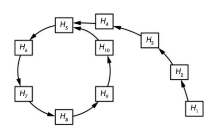
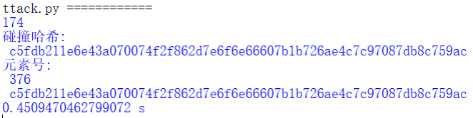

# Implement the ρ method of reduced SM3

## 前言、项目说明

Hash函数的ρ方法是用来寻找散列碰撞而不需要大量的内存。它的想法是不断地对前一个哈希运算的结果进行哈希运算。

当我们对一个起始值进行散列，然后对该散列进行散列，并重复这个过程，不会永远得到不同的数字。

最终我们会得到一个重复的值，之后所有进一步的值都是之前值的重复，在一个循环中进行，如下图所示：



## 一、低存储复杂度的寻找碰撞：ρ方法

### 工作机制

不同于生日攻击，ρ方法寻找碰撞只需要很少的存储空间，工作方式如下：

1. 给定一个n-bit长的hash函数，随机选择hash值$H_1$，并定义$H_1=H_1'$
2. 计算$H_2$=Hash($H_1$)，并计算$H_1$' =Hash(Hash($H_1$' ))。即在第一个情形中，我们应用一次Hash函数，而第二个情形中，我们应用两次
3. 迭代这个过程并计算$H_{i+1}$=Hash($H_i$)，$H_{i+1}$' =Hash(Hash($H_i$' ))，直到计算到第i个数，满足$H_{i+1}$=$H_{i+1}$'

### 寻找碰撞

1. 检测循环的开始
2. 查找碰撞

- 既不需要在内存中存储大量的值，也不需要对长的列表进行排序
- ρ方法大约需要2n/2 次操作才能成功
  - 平均来说，循环和尾部（图中从H1延伸到H5的部分）各包括约2n/2 个哈希值，其中n是哈希值的长度
  - 因此，我们需要至少2n/2 + 2n/2 次计算来发现一个碰撞

## 二、具体实现

### 进行碰撞攻击前的准备

代码功能：

> 1. 将所需模块导入：从 `gmssl` 模块导入 `func`、`sm3`，从 `time` 模块导入 `time` 函数。
> 2. 创建 `rho` 函数：接受参数 `n`（攻击长度）和 `mess`（初始信息）。
> 3. 初始化变量：建立一个空列表 `lis`，用于存储哈希值。
> 4. 计算初始信息的哈希值：运用 `sm3.sm3_hash` 函数，将 `mess` 转化为字节列表，并计算哈希值，接着将其哈希值的前 `n` 位添加到列表 `lis` 中。

代码展示：

```python
from time import time
from gmssl import sm3, func

#n为攻击长度，mess为初始信息
def rho(n,mess):
  flag = 0
  lis = []
  lis.append(sm3.sm3_hash(func.bytes_to_list(mess))[:n])
```

### 碰撞攻击

代码功能：

> rho函数：
>
> 1. 进入循环，在每次循环中，取 `lis` 列表中最后一个哈希值 `x`，将其转换为字节列表，并计算哈希值
> 2. 取该哈希值的前 `n` 位作为 `t_x`
> 3. 检查 `t_x` 是否已经存在于 `lis` 列表中
>    - 如果存在，则表示找到了哈希碰撞，打印碰撞的信息，并结束循环
>    - 如果不存在，则将 `t_x` 添加到 `lis` 列表中，并继续下一轮循环
> 4. 在找到碰撞后，计算攻击所花费的时间，并打印
>
> 主程序：
>
> 1. 调用 `rho` 函数：以 `n=4` 和 `mess=b'sm3rhoattack'` 作为参数调用 `rho` 函数，进行哈希碰撞攻击

代码展示：

```python
  start = time()
  while(1):
    data = bytes(lis[-1], encoding='utf-8')
    x = sm3.sm3_hash(func.bytes_to_list(data))
    data = bytes(x, encoding='utf-8')
    t_x = sm3.sm3_hash(func.bytes_to_list(data)[:n])
    for j in lis:
        if t_x == j:
            print(lis.index(j),"\n碰撞哈希:\n", j, "\n元素号:\n", len(lis), '\n',t_x)
            flag=1
            break
    if flag == 1:
        break
    lis.append(t_x)
  end = time()
  print(end-start,"s")

n = 4
mess = b'sm3rhoattack'
rho(n,mess)
```

## 三、实现效果

本次实验我们对前四个字节（即32bit）进行碰撞测试，测试结果如下所示：



## 四、参考

1. <https://samsclass.info/141/proj/C106.htm#:~:text=The%20Rho%20method%20is%20used%20to%20find%20hash,do%20when%20calculating%20password%20hashes%20with%20many%20rounds>
2. Serious Cryptography：A Practical Introduction to Modern Encryption by Jean-Philippe Aumasson
3. PPT：20230330-sm3-public

