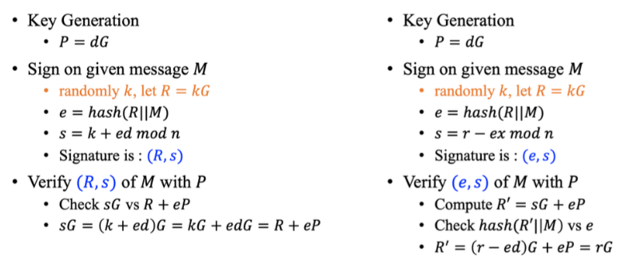
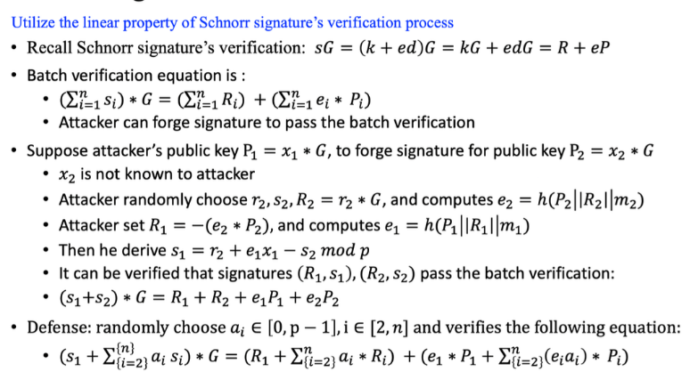
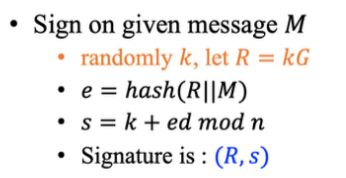
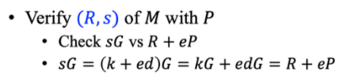
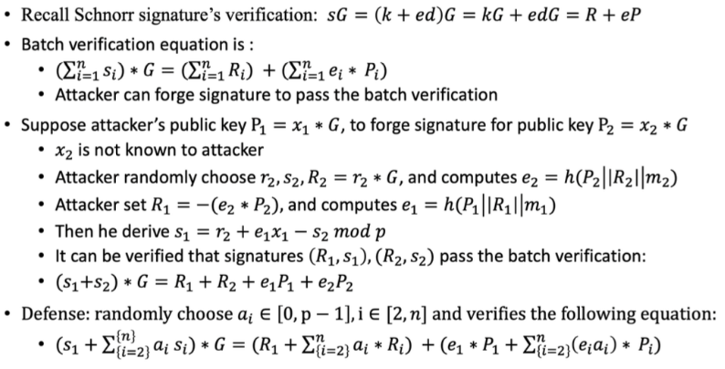
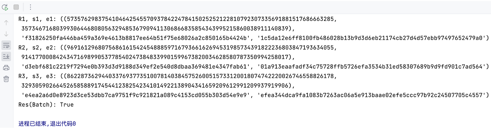

# Schnorr Bacth

## Project

### Project简介

签名流程：



批量验证签名：



基于上述原理，现对Schnorr Bacth进行代码实现。具体细节如下所示：

## 具体实现

### 实验环境

基于pycharm编译器导入random、gmssl库运行Schnorr Bacth文件

### Schnorr_Bacth实现

#### 定义椭圆曲线加法、乘法运算函数

##### 代码功能

1. `add_points(P, Q, q_int)`：实现椭圆曲线上的点加法运算
2. `double_point(P, a_int, q_int)`：实现椭圆曲线上的点加倍运算
3. `scalar_multiply(P, k, a_int, q_int)`：实现椭圆曲线上的点的标量乘法运算，即将点P与整数k相乘得到点Q

##### 代码展示

```python
'''定义椭圆曲线加法和乘法运算函数'''
def add_points(P, Q, q_int):
    # 椭圆曲线点加法运算
    if P == (0, 0):
        return Q
    if Q == (0, 0):
        return P
    x1, y1, x2, y2 = P[0], P[1], Q[0], Q[1]
    tmp1, tmp2 = y2 - y1, pow(x2 - x1, -1, q_int)
    l = (tmp1 * tmp2) % q_int
    x = (l * l - x1 - x2) % q_int
    y = (l * (x1 - x) - y1) % q_int
    return x, y

def double_point(P, a_int, q_int):
    # 椭圆曲线点加倍运算
    if P == (0, 0):
        return P
    x1, y1 = P[0], P[1]
    tmp1 = (3 * x1 * x1 + a_int) % q_int
    tmp2 = pow(2 * y1, -1, q_int)
    l = (tmp1 * tmp2) % q_int
    x = (l * l - 2 * x1) % q_int
    y = (l * (x1 - x) - y1) % q_int
    return x, y

def scalar_multiply(P, k, a_int, q_int):
    # 椭圆曲线点的标量乘法运算
    Q = (0, 0)
    while k > 0:
        if k & 1:
            Q = add_points(Q, P, q_int)
        k >>= 1
        P = double_point(P, a_int, q_int)
    return Q
```

#### 验证点是否在椭圆曲线上：

##### 代码功能

- `check_point(P, a_int, b_int, q_int)`：验证给定的点P是否在指定的椭圆曲线上。

##### 代码展示

```python
'''检查点是否在椭圆曲线上'''
def check_point(P, a_int, b_int, q_int):
    # 验证给定点是否在椭圆曲线上
    x, y = P[0], P[1]
    if (y * y) % q_int == (x * x * x + a_int * x + b_int) % q_int:
        return True
    return False
```

#### 实现SM3哈希函数：

##### 代码功能

- `sm3_hash(message)`: 用于对输入的消息进行哈希处理，返回哈希值。

##### 代码展示

```python
'''实现SM3哈希函数'''
def sm3_hash(message):
    # SM3哈希函数，对输入的消息进行哈希处理
    message = message.encode('utf-8')
    hash_hex = sm3.sm3_hash([i for i in message])
    return hash_hex
```

#### 实现Schnorr签名方案：

##### 代码功能

1. `Schnorr_sign(M, G, n, q_int, a_int, d_int)`: 生成Schnorr签名。

   1. 生成随机数k

   2. 计算点R = k*G

   3. 计算e = H(x_R || y_R || M)（其中H为SM3哈希函数）

   4. 计算签名s = (k + e * d) % n

   5. 返回签名R、s和哈希值e



2. `Schnorr_verify(R, s, e, G, P, q_int, a_int, n)`: 验证Schnorr签名

   1. 根据签名中的e值计算点eP = e*P、sG = s*G

   2. 计算R_sum = R + eP

   3. 比较sG与R_sum是否相等




##### 代码展示

```python
'''实现Schnorr签名方案'''
def Schnorr_sign(M, G, n, q_int, a_int, d_int):
    # Schnorr签名生成
    k = random.randint(1, n - 1)
    R = scalar_multiply(G, k, a_int, q_int)
    x_R, y_R = R[0], R[1]
    e = sm3_hash(str(x_R) + str(y_R) + M)
    s = hex((k + int(e, 16) * d_int) % n)[2:]
    return R, s, e

def Schnorr_verify(R, s, e, G, P, q_int, a_int, n):
    # Schnorr签名验证
    sG = scalar_multiply(G, int(s, 16), a_int, q_int)
    eP = scalar_multiply(P, int(e, 16), a_int, q_int)
    R_sum = add_points(R, eP, q_int)
    if sG == R_sum:
        return True
    return False
```

#### 设置参数

##### 代码功能

- 在代码中给定了椭圆曲线和签名方案所需的参数（素数q、系数a、常数b、基点G、基点的阶n和私钥d）

##### 代码展示

```python
'''设置参数'''
# 参数设定
q = "fffffffffffffffffffffffffffffffffffffffffffffffffffffffefffffc2f"
a = "0"
b = "7"
x_G = "79be667ef9dcbbac55a06295ce870b07029bfcdb2dce28d959f2815b16f81798"
y_G = "483ada7726a3c4655da4fbfc0e1108a8fd17b448a68554199c47d08ffb10d4b8"
G = (int(x_G, 16), int(y_G, 16))
n = "fffffffffffffffffffffffffffffffebaaedce6af48a03bbfd25e8cd0364141"
d = random.randint(pow(2, 127), pow(2, 128))
P = scalar_multiply(G, d, int(a, 16), int(q, 16))

M1 = "2513"
M2 = "5133"
M3 = "1339"
```

#### 批量验证

##### 代码功能

1. 使用随机选择的私钥d生成三个不同消息的Schnorr签名
2. 分别验证签名的正确性
3. 使用批量验证函数`Schnorr_verify_Batch`验证三个签名是否有效



##### 代码展示

```python
'''批量验证'''
# 生成Schnorr签名并输出结果
R1, s1, e1 = Schnorr_sign(M1, G, int(n, 16), int(q, 16), int(a, 16), d)
print(f'R1, s1, e1: {R1, s1, e1}')

R2, s2, e2 = Schnorr_sign(M2, G, int(n, 16), int(q, 16), int(a, 16), d)
print(f'R2, s2, e2: {R2, s2, e2}')

R3, s3, e3 = Schnorr_sign(M3, G, int(n, 16), int(q, 16), int(a, 16), d)
print(f'R3, s3, e3: {R3, s3, e3}')

R_list = [R1, R2, R3]
s_list = [s1, s2, s3]
e_list = [e1, e2, e3]

# 批量验证Schnorr签名并输出结果
res_Batch = Schnorr_verify(R_list[0], s_list[0], e_list[0], G, P, int(q, 16), int(a, 16), int(n, 16))
print(f'Res(Batch): {res_Batch}')
```

## 输出结果展示



由上图可知，批量验证Schnorr签名通过，给定的一组Schnorr签名是有效的，且均由相应私钥对应的公钥生成。

## 参考

PPT：20230401-btc-public