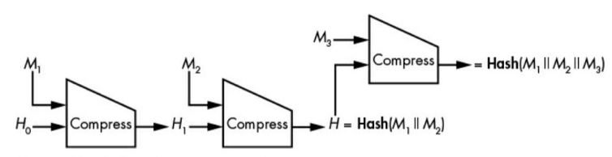
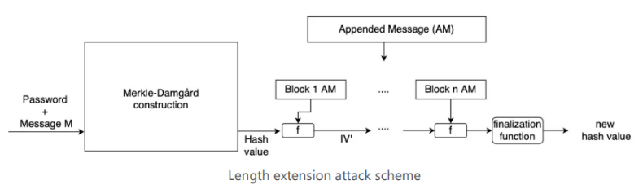
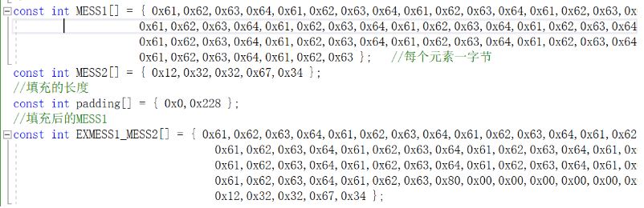
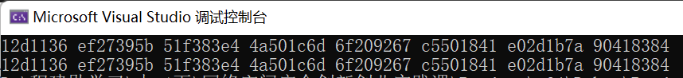

# implement length extension attack for SM3, SHA256, etc

## 前言、项目说明

本项目实现了基于SM3的长度扩展攻击

## 一、长度扩展攻击

### 概述

长度扩展攻击是指针对特定hash函数（尤其是MD结构的hash函数）的一种攻击手段，攻击者可以利用H(M1)和M1的长度，在不知道M1内容的情形下，将攻击者控制的M2计算出H（M1 ‖ M2）



其核心是：

> 1. 将H(M1)作为对M2做hash的IV值输入
> 2. 根据已知的M1的长度和M2的长度确定新的填充长度，再进行hash
>
> 就能得到伪造的H(M1||M2)的值。

### 实现思路

下图表示具体的对于长度扩展攻击如何实现：



具体的关于长度扩展攻击的其他详细信息放到参考[1]中供大家学习。

## 二、具体实现

### 1. 初始化

#### 定义常量

本段给出用于测试的数据数组`MESS1`和`MESS2`，以及用于填充的常量`padding`和`EXMESS1_MESS2`

#### 定义宏

常用的 `ll`, `a`, `b`, `c`, `d`, `e`, `f`, `g`, `h`等宏，在本代码中有分别用于表示SM3算法中的8个寄存器 `a` 到 `h` 的索引的用途

#### 初始化常量数组

初始向量 `IV` 是由 8 个32位整数组成的。同时，还有一个常量表 `T`，它包含了64个32位整数。这两者在压缩函数的迭代过程中起到重要作用。

### 2. 辅助函数

#### `_init_T()`函数

##### 代码说明

每次在进行SM3计算之前，必须先初始化常量表T

##### 代码呈现

```c++
void _init_T()
{
	int i = 0;
	for (; i < 16; i++)
		T[i] = 0x79CC4519;
	for (; i < 64; i++)
		T[i] = 0x7A879D8A;
}
```

#### `ROTL()`函数

##### 代码说明

实现对32位整数进行循环左移操作

##### 代码呈现

```c++
int ROTL(int X, int n) {
	return (((X << n) & 0xffffffff) | ((X & 0xffffffff) >> (32 - n)));
}
```

#### `FF()` 和 `GG()`函数

##### 代码说明

迭代过程中采用布尔函数以压缩函数内容。

##### 代码呈现

```c++
int FF(int X, int Y, int Z, int j) {
	if (j < 16 && j >= 0)
		return(X ^ Y ^ Z);
	if (j > 15 && j < 64)
		return((X & Y) | (X & Z) | (Y & Z));
	return false;
}
int GG(int X, int Y, int Z, int j) {
	if (j < 16 && j >= 0)
		return(X ^ Y ^ Z);
	if (j > 15 && j < 64)
		return ((X & Y) | ((~X) & Z));
	return false;
}
```

##### `P0()`和`P1()`函数

##### 代码说明

该函数用于消息扩展和压缩函数中的迭代过程

##### 代码呈现

```c++
//压缩函数中的置换函数
int P0(int X) {
	return X ^ ROTL(X, 9) ^ ROTL(X, 17);
}
//消息扩展中的置换函数
int P1(int X) {
	return X ^ ROTL(X, 15) ^ ROTL(X, 23);
}
```

### 3. 压缩函数`CF()`

#### 代码说明

1. 此函数具体实现了压缩功能，对输入的8个32位整数（V表示）进行单轮压缩。
2. 在该函数内部，涵盖了SM3算法所需的多项操作，包括消息扩展、位运算、以及布尔函数等步骤。

#### 代码展示

```c++
void CF(int* v, int* B) {
	int W68[68] = { 0 };
	int W64[64] = { 0 };
	int V[8] = { 0 };
	for (int i = 0; i < 8; i++)
		V[i] = v[i];
	//消息拓展
	int j = 0;
	for (; j < 16; j++)
		W68[j] = B[j];
	for (; j <= 67; j++)
		W68[j] = P1(W68[j - 16] ^ W68[j - 9] ^ ROTL(W68[j - 3], 15)) ^ ROTL(W68[j - 13], 7) ^ W68[j - 6];
	for (j = 0; j < 64; j++)
		W64[j] = W68[j] ^ W68[j + 4];
	//压缩函数
	int SS1 = 0, SS2 = 0, TT1 = 0, TT2 = 0;
	for (j = 0; j < 64; j++) {
		SS1 = ROTL(ROTL(V[a], 12) + V[e] + ROTL(T[j], j), 7);
		SS2 = SS1 ^ ROTL(V[a], 12);
		TT1 = FF(V[a], V[b], V[c], j) + V[d] + SS2 + W64[j];
		TT2 = GG(V[e], V[f], V[g], j) + V[h] + SS1 + W68[j];
		V[d] = V[c];
		V[c] = ROTL(V[b], 9);
		V[b] = V[a];
		V[a] = TT1;
		V[h] = V[g];
		V[g] = ROTL(V[f], 19);
		V[f] = V[e];
		V[e] = P0(TT2);
	}
	for (int i = 0; i < 8; i++)
		v[i] ^= V[i];
}
```

### 4. 迭代函数`iterate()`

#### 代码说明

此函数将对填充后的数据块 `B`（每块512位，即64字节）进行迭代压缩，直至所有数据块处理完成。

#### 代码呈现

```c++
void iterate(int* B, int* V, int n) {
	for (int i = 0; i < 8; i++)
		V[i] = IV[i];
	for (int i = 0; i < n; i++)
		CF(V, (B + (i * 16)));
}
```

### 5. 入口函数`SM3()`

#### 代码说明

对输入数据块进行填充，采用512位进行迭代压缩，生成最终的哈希值。

#### 代码呈现

```c++
//哈希函数，输入输出均为每个元素4字节的int类型数组，size为字节数
void SM3(int* input, int* output, ll size) {
	_init_T();
	//填充
	ll n = size / 64;
	ll k = size % 64;
	size *= 8;	//总bit数
	//512bit，即16个字为一组B[i]，一共16 * (n + 1)个元素，即n+1组
	int* B = new int[16 * (n + 1)];
	B[16 * n + 15] = size;
	B[16 * n + 14] = size >> 32;
	int i = 0;
	for (; i < 16 * n + k / 4; i++)
		B[i] = input[i];
	if (k % 4 == 0)
		B[i] = 0x80000000;
	else
		B[i] = input[i] | (0x80 << ((3 - (k % 4)) * 8));
	++i;
	for (; i < 16 * n + 14; i++)
		B[i] = 0;
	n++;

	iterate(B, output, n);
}
```

### 6. `SM3_LEA()` 函数

#### 代码说明

与 `SM3()` 函数类似，不同之处在于在最后一组迭代中，采用了提供的初始化向量 `Iv` 进行计算。

#### 代码呈现

```c++
void SM3_LEA(int* input, int* output, ll size, int* Iv) {
	_init_T();
	//填充
	ll n = size / 64;
	ll k = size % 64;
	size *= 8;	//总bit数
	//512bit，即16个字为一组B[i]，一共16 * (n + 1)个元素，即n+1组
	int* B = new int[16 * (n + 1)];
	B[16 * n + 15] = padding[1];
	B[16 * n + 14] = padding[0];
	int i = 0;
	for (; i < 16 * n + k / 4; i++)
		B[i] = input[i];
	if (k % 4 == 0)
		B[i] = 0x80000000;
	else
		B[i] = input[i] | (0x80 << ((3 - (k % 4)) * 8));
	++i;
	for (; i < 16 * n + 14; i++)
		B[i] = 0;
	n++;
	for (int i = 0; i < 8; i++)
		output[i] = Iv[i];
	for (int i = 0; i < n; i++)
		CF(output, (B + (i * 16)));
}
```

### 7. 攻击函数`attack()` 

#### 代码说明

1. 进行哈希碰撞攻击的函数步骤如下所示：
   1. 首先，将 `MESS1` 和 `MESS2` 数组转换成对应的哈希值 `V` 、 `V2`。
   2. 接着，使用 `V` 作为初始化向量，对 `MESS2` 进行哈希运算，得到更新后的哈希值 `V2`。
   3. 最后，将新的 `V2` 输出。

#### 代码呈现

```c++
void attack() {
	//先获得MESS1的哈希值
	ll size = sizeof(MESS1) / sizeof(int);	//size为所占的字节数
	int V[8] = { 0 };
	int* B = new int[size / 4 + (bool)(size % 4)];
	int i = 0;
	for (; i < size / 4; i++)
		B[i] = MESS1[i * 4] << 24 | MESS1[i * 4 + 1] << 16 | MESS1[i * 4 + 2] << 8 | MESS1[i * 4 + 3];
	if (size % 4) {
		B[i] = 0;
		for (int k = 0; k < size % 4; k++)
			B[i] = B[i] | (MESS1[i * 4 + k] << (8 * (3 - k)));
	}
	SM3(B, V, size);
	size = sizeof(MESS2) / sizeof(int);
	int V2[8] = { 0 };
	int* B2 = new int[size / 4 + (bool)(size % 4)];
	i = 0;
	for (; i < size / 4; i++)
		B2[i] = MESS2[i * 4] << 24 | MESS2[i * 4 + 1] << 16 | MESS2[i * 4 + 2] << 8 | MESS2[i * 4 + 3];
	if (size % 4) {
		B2[i] = 0;
		for (int k = 0; k < size % 4; k++)
			B2[i] = B2[i] | (MESS2[i * 4 + k] << (8 * (3 - k)));
	}
	SM3_LEA(B2, V2, size, V);
	cout << hex;
	for (int i = 0; i < 8; i++)
		cout << V2[i] << ' ';
	cout << endl;

}
```

### 8. 哈希测试函数`test()` 

#### 代码说明

对于一个测试数据 `EXMESS1_MESS2`，进行哈希运算，并将结果输出。

#### 代码呈现

```python
void test() {
	//首先把一个元素一个字节的数组MESS(字符串)，变为一个元素一个字的数组B(int)
	ll size = sizeof(EXMESS1_MESS2) / sizeof(int);	//size为所占的字节数
	int V[8] = { 0 };

	int* B = new int[size / 4 + (bool)(size % 4)];
	int i = 0;
	for (; i < size / 4; i++)
		B[i] = EXMESS1_MESS2[i * 4] << 24 | EXMESS1_MESS2[i * 4 + 1] << 16 | EXMESS1_MESS2[i * 4 + 2] << 8 | EXMESS1_MESS2[i * 4 + 3];
	if (size % 4) {
		B[i] = 0;
		for (int k = 0; k < size % 4; k++)
			B[i] = B[i] | (EXMESS1_MESS2[i * 4 + k] << (8 * (3 - k)));
	}
	SM3(B, V, size);

	cout << hex;
	for (int i = 0; i < 8; i++)
		cout << V[i] << ' ';

}
```

## 三、实现效果

以下可以自己选择填写对应的消息：



如图，EXMESS1_MESS2就是我们根据H(MESS1)和MESS1长度伪造hash的对应的信息，我们可以验证，上面的输出是我们进行伪造时得到的hash值，下面的输出是我们伪造的目标信息进行hash得到的结果



经验证，根据H(MESS1)和MESS1长度伪造hash与对应信息的哈希值一致，说明我们的攻击成功

## 四、参考

- <https://justcryptography.com/length-extension-attack/>
- PPT：20230330-sm3-public
