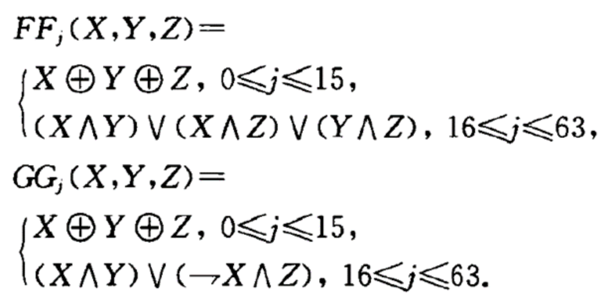
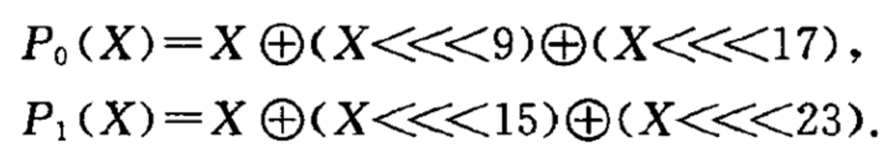
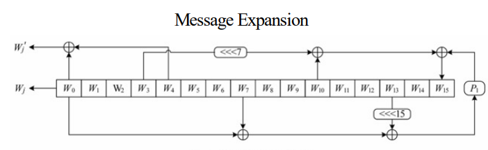
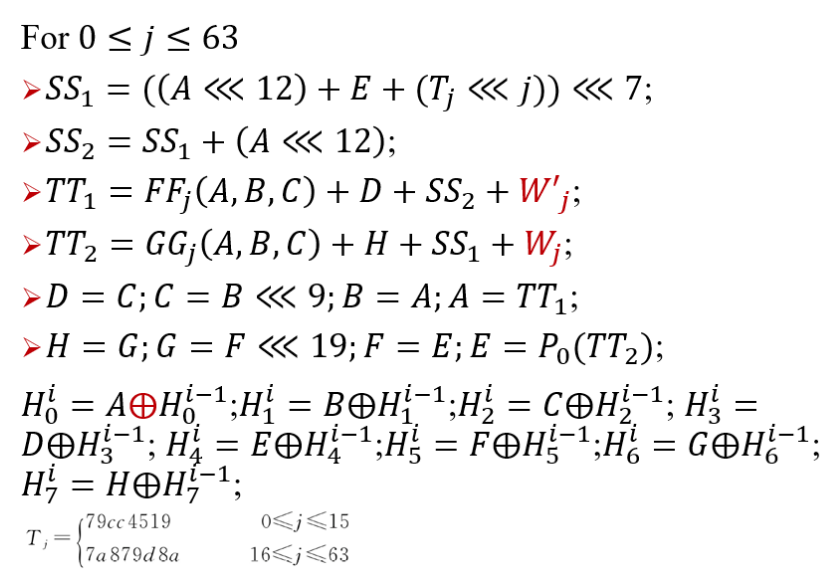
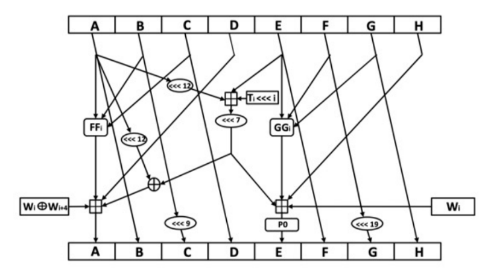
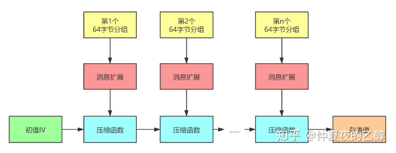
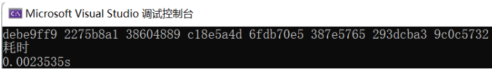
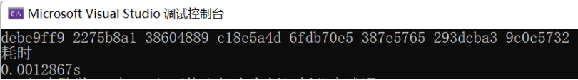
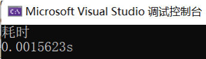
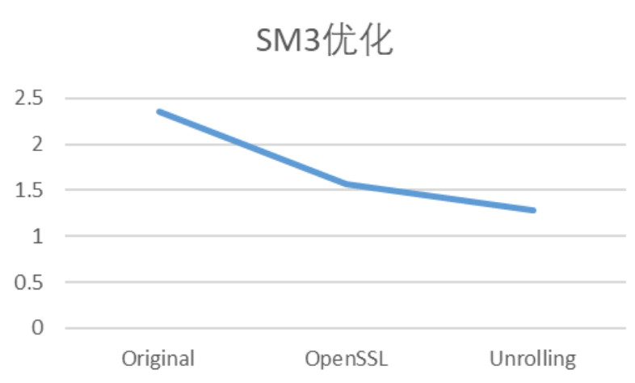

# Do your best to optimize SM3 implementation

## 前言、项目说明

基于个人实现的SM3进行软件优化，主要运用了循环展开和减少函数的调用来进行优化

## 一、SM3介绍

### SM3概述

- MD结构，长度小于2<sup>64</sup>bit的消息
- 消息分组为512-bit，中间链接变量为256-bit，杂凑值为256-bit
- 压缩函数共64步操作
- 布尔函数：




- 置换函数：



### 消息填充算法
SM3数据填充规则和SHA256一样，具体步骤如下：

1. 先填充一个“1”，后面加上k个“0”。其中k是满足(n+1+k) mod 512 = 448的最小正整数。
2. 追加64位的数据长度（bit为单位，大端序存放。观察算法标准原文附录A运算示例可以推知。）


### 消息扩展算法
记第i个512比特的消息分组为𝑀<sub>0</sub><sup>𝑖</sup>,...,𝑀<sub>15</sub><sup>𝑖</sup>。按如下步骤生成132个32比特的消息字：

> - For t=0 to 15
>
>   𝑊<sub>t</sub> = 𝑀<sub>t</sub><sup>𝑖</sup>
>
> - For t=16 to 67
>
>   𝑊<sub>t</sub> = 𝑃<sub>1</sub>(𝑊<sub>t-16</sub>⨁𝑊<sub>t-9</sub>⨁(𝑊<sub>t-3</sub>⋘15))⨁(𝑊<sub>t-1</sub>⋘7)⨁𝑊<sub>t-6</sub>
>
> - For t=0 to 63
>
>   𝑊<sub>t</sub><sup>'</sup>=𝑊<sub>t</sub> ⨁𝑊<sub>t+4</sub>



### 压缩函数
初始IV是固定的常数





#### 迭代压缩



## 二、具体实现

### 优化前original文件实现

#### 定义常量、宏

代码功能：

> - 定义了8个32位无符号整数的数组 `IV` 作为初始向量。
> - 定义了64个32位无符号整数的数组 `T`，这是SM3算法中的常量表，用于迭代计算中。
> - 定义了8个宏，分别用于表示SM3算法中的8个寄存器 `a` 到 `h` 的索引。

#### 初始化常量表

代码功能：

> 在 `_init_T()` 函数中对 `T` 数组进行初始化

#### 循环左移实现

代码功能：

> 在 `ROTL()` 函数中实现对32位整数的循环左移

代码展示：

```c++
/* 循环左移，对int类型变量X循环左移n位 */
int ROTL(int X, int n)
{
	return (((X << n) & 0xffffffff) | ((X & 0xffffffff) >> (32 - n)));
}
```

#### 布尔函数

代码功能：

> `FF()` 和 `GG()` 函数是SM3算法中的两种布尔函数，用于压缩函数的迭代过程中

代码展示：

```c++
/* 布尔函数 */
int FF(int X, int Y, int Z, int j) 
{
	if (j < 16 && j >= 0)
		return(X ^ Y ^ Z);
	if (j > 15 && j < 64)
		return((X & Y) | (X & Z) | (Y & Z));
	return false;
}

int GG(int X, int Y, int Z, int j) 
{
	if (j < 16 && j >= 0)
		return(X ^ Y ^ Z);
	if (j > 15 && j < 64)
		return ((X & Y) | ((~X) & Z));
	return false;
}
```

#### 压缩函数

代码功能：

> `CF()` 函数是SM3算法的核心压缩函数：
>
> 1. 将8个32位无符号整数（寄存器）作为输入
> 2. 按照SM3算法的迭代计算规则进行一轮压缩
> 3. 压缩函数将输入的消息分组进行扩展（消息拓展）
> 4. 进行64轮迭代，最终得到8个更新后的寄存器值

代码展示：

```c++
/* 压缩函数 */
void CF(int* v, int* B)
{
	int W68[68] = { 0 };
	int W64[64] = { 0 };
	int V[8] = { 0 };
	for (int i = 0; i < 8; i++)
		V[i] = v[i];
	/* 消息拓展 */
	int j = 0;
	for (; j < 16; j++) 
	{
		W68[j] = B[j];
	}
	for (; j <= 67; j++) 
	{
		int w0 = W68[j - 16] ^ W68[j - 9] ^ ROTL(W68[j - 3], 15);
		W68[j] = w0 ^ ROTL(w0, 15) ^ ROTL(w0, 23) ^ ROTL(W68[j - 13], 7) ^ W68[j - 6];
	}
	for (int i = 0; i < 64; i++) 
	{
		W64[i] = W68[i] ^ W68[i + 4];
	}
	/* 压缩函数 */
	int SS1 = 0, SS2 = 0, TT1 = 0, TT2 = 0;
	for (int j = 0; j < 64; j++) 
	{
		SS1 = ROTL(ROTL(V[a], 12) + V[e] + ROTL(T[j], j), 7);
		SS2 = SS1 ^ (((V[a] << 12) & 0xffffffff) | ((V[a] & 0xffffffff) >> (32 - 12)));
		TT1 = FF(V[a], V[b], V[c], j) + V[d] + SS2 + W64[j];
		TT2 = GG(V[e], V[f], V[g], j) + V[h] + SS1 + W68[j];
		V[d] = V[c];
		V[c] = ((V[b] << 9) & 0xffffffff) | ((V[b] & 0xffffffff) >> (32 - 9));
		V[b] = V[a];
		V[a] = TT1;
		V[h] = V[g];
		V[g] = ((V[f] << 19) & 0xffffffff) | ((V[f] & 0xffffffff) >> (32 - 19));
		V[f] = V[e];
		V[e] = TT2 ^ ROTL(TT2, 9) ^ ROTL(TT2, 17);
	}

	for (int i = 0; i < 8; i++)
		v[i] ^= V[i];
}
```

#### 哈希函数

代码功能：

> `SM3()`是SM3算法的入口函数，用于进行消息的哈希计算：
>
> 1. 对输入消息进行填充
> 2. 按照512位（64字节）一组进行分组
> 3. 调用压缩函数对每个分组进行迭代压缩
> 4. 得到8个32位无符号整数作为哈希结果

代码展示：

```c++
/* 哈希函数，输入输出均为每个元素4字节的int类型数组，size为字节数 */
void SM3(int* input, int* output, ll size)
{
	//填充
	ll n = size / 64;
	ll k = size % 64;
	size *= 8;	//总bit数
	/* 512bit，即16个字为一组B[i]，一共16 * (n + 1)个元素，即n+1组 */
	int* B = new int[16 * (n + 1)];
	int i = 0;
	int x = 16 * n;
	for (; i < x; i++) 
	{
		B[i] = input[i];
	}
	x += k / 4;
	for (; i < x; i++)
		B[i] = input[i];
	if (k % 4 == 0)
		B[i] = 0x80000000;
	else
		B[i] = input[i] | (0x80 << ((3 - (k % 4)) * 8));
	++i;
	//循环展开
	x = 16 * n + 14;
	for (; i < x; i++) 
	{
		B[i] = 0;
	}
	B[16 * n + 15] = size;
	B[16 * n + 14] = size >> 32;
	n++;
	//iterate(B, output, n);
	for (int j = 0; j < 8; j++)
	{
		output[j] = IV[j];
	}
	for (int i = 0; i < n; i++)
		CF(output, (B + (i * 16)));
}
```

#### 测试函数

代码功能：

> `test()`使用预设的测试数据 `MESS`：
>
> 1. 将测试数据转换成32位整数的数组 `B`
> 1. 调用 `SM3()` 函数进行哈希计算，并输出结果

代码展示：

> ```c++
> /* 测试函数 */
> void test() 
> {
>    _init_T();
>    //首先把一个元素一个字节的数组MESS(字符串)，变为一个元素一个字的数组B(int)
>    ll size = sizeof(MESS) / sizeof(int);  //size为所占的字节数
>    int V[8] = { 0 };
>    int* B = new int[size / 4 + (bool)(size % 4)];
>    int i = 0;
>    for (; i < size / 4; i++)
>       B[i] = MESS[i * 4] << 24 | MESS[i * 4 + 1] << 16 | MESS[i * 4 + 2] << 8 | MESS[i * 4 + 3];
>    if (size % 4) 
>    {
>       B[i] = 0;
>       for (int k = 0; k < size % 4; k++)
>          B[i] = B[i] | (MESS[i * 4 + k] << (8 * (3 - k)));
>    }
>    //然后将B作为SM3的输入
>    SM3(B, V, size);
>    cout << hex;
>    for (int i = 0; i < 8; i++)
>       cout << V[i] << ' ';
> }
> ```

#### 主函数

代码功能：

> 在 `main()` 函数中调用 `test()` 函数并计算运行时间，输出哈希结果和运行耗时

代码展示：

```c++
int main()
{
	std::chrono::time_point<std::chrono::steady_clock> start = std::chrono::steady_clock::now();
	test();
	std::chrono::time_point<std::chrono::steady_clock> end = std::chrono::steady_clock::now();
	std::chrono::duration<double> elapsed = end - start;
	cout << "\n耗时\n" << elapsed.count() << "s";
	return 0;
}
```

### 优化后optimization文件实现

相较于基本的SM3实现（original文件），本文件做出了以下几方面的优化：

#### 使用Loop Unrolling循环展开优化

##### `_init_T()` 函数：

原先的 `_init_T()` 函数是用一个循环分别给常量表 `T` 的前16个元素和后48个元素赋值。循环展开优化后，将原本的循环拆分成两个循环，分别为前16个元素和后48个元素进行赋值，每次循环给4个元素赋相同的值，从而提高了赋值的效率。

```c++
void _init_T()
{
    int i = 0;
    for (; i < 16; i += 4)
    {
        T[i] = 0x79CC4519;
        T[i + 1] = 0x79CC4519;
        T[i + 2] = 0x79CC4519;
        T[i + 3] = 0x79CC4519;
    }

    for (; i < 64; i += 4)
    {
        T[i] = 0x7A879D8A;
        T[i + 1] = 0x7A879D8A;
        T[i + 2] = 0x7A879D8A;
        T[i + 3] = 0x7A879D8A;
    }
}
```

##### `CF()` 函数：

在 `CF()` 函数中，对消息进行拓展和压缩时，原本有两个循环用于分别赋值 `W68` 和 `W64` 数组的元素。循环展开优化后，将这两个循环分别拆分成四个循环，每次循环给4个元素赋值，从而提高了赋值的效率。

```c++
void CF(int* v, int* B)
{
    int W68[68] = { 0 };
    int W64[64] = { 0 };
    int V[8] = { 0 };
    V[0] = v[0];
    V[1] = v[1];
    V[2] = v[2];
    V[3] = v[3];
    V[4] = v[4];
    V[5] = v[5];
    V[6] = v[6];
    V[7] = v[7];

    int j = 0;
    for (; j < 16; j += 4)
    {
        W68[j] = B[j];
        W68[j + 1] = B[j + 1];
        W68[j + 2] = B[j + 2];
        W68[j + 3] = B[j + 3];
    }
    for (; j <= 67; j++)
    {
        int w0 = W68[j - 16] ^ W68[j - 9] ^ ROTL(W68[j - 3], 15);
        W68[j] = w0 ^ ROTL(w0, 15) ^ ROTL(w0, 23) ^ ROTL(W68[j - 13], 7) ^ W68[j - 6];
    }
    for (int i = 0; i < 64; i += 4)
    {
        W64[i] = W68[i] ^ W68[i + 4];
        W64[i + 1] = W68[i + 1] ^ W68[i + 4 + 1];
        W64[i + 2] = W68[i + 2] ^ W68[i + 4 + 2];
        W64[i + 3] = W68[i + 3] ^ W68[i + 4 + 3];
    }
    // 压缩函数
    // ...
}

```

#### 使用了移位等操作代替乘除模

##### `test()`函数：

在每次循环中，通过位移和按位或运算，将 `MESS` 中的四个字节按照大端序组合成一个整型数，并将结果存储在数组 `B` 中

```C++
for (; i < size / 4; i++)
		B[i] = MESS[i * 4] << 24 | MESS[i * 4 + 1] << 16 | MESS[i * 4 + 2] << 8 | MESS[i * 4 + 3];
	if (size % 4)
	{
		B[i] = 0;
		for (int k = 0; k < size % 4; k++)
			B[i] = B[i] | (MESS[i * 4 + k] << (8 * (3 - k)));
	}
```

#####`_init_T()` 函数：

`_init_T()`函数中初始化T数组的部分，原代码中使用了两次循环分别给T的前16和后48个元素赋值，优化后的代码将这两次循环合并，并用移位操作代替乘法，从而提高了效率。

```c++
void _init_T()
{
	int i = 0;
	for (; i < 16; i += 4)
	{
		T[i] = 0x79CC4519;
		T[i + 1] = 0x79CC4519;
		T[i + 2] = 0x79CC4519;
		T[i + 3] = 0x79CC4519;
	}

	for (; i < 64; i += 4)
	{
		T[i] = 0x7A879D8A;
		T[i + 1] = 0x7A879D8A;
		T[i + 2] = 0x7A879D8A;
		T[i + 3] = 0x7A879D8A;
	}
}
```

##### `FF`函数和`GG`函数：

使用了更简洁的方式进行`FF`函数和`GG`函数中的布尔逻辑部分，并用移位操作来代替乘法。

```c++
int FF(int X, int Y, int Z, int j)
{
	if (j < 16 && j >= 0)
		return X ^ Y ^ Z;
	if (j > 15 && j < 64)
		return (X & Y) | (X & Z) | (Y & Z);
	return false;
}

int GG(int X, int Y, int Z, int j)
{
	if (j < 16 && j >= 0)
		return X ^ Y ^ Z;
	if (j > 15 && j < 64)
		return X & Y | ~X & Z;
	return false;
}
```

### 使用openssl库文件实现

#### 代码功能

1. 将整型数组 `MESS` 强制转换为 `unsigned char*` 类型，以便后续哈希计算使用。
2. 创建了一个用于存储哈希结果的数组 `digest`，长度为 `SM3_DIGEST_LENGTH`，即 32 字节。
3. 创建了一个指向 `EVP_MD_CTX` 结构体的指针 `mdctx`，该结构体用于计算哈希值。
4. 获取了 SM3 哈希算法的 EVP（EVP_MD）对象，并将其指针保存在 `md` 中。
5. 初始化哈希计算上下文 `mdctx`，将其和选定的哈希算法 `md` 关联。
6. 更新哈希计算上下文，将数据 `message`（即 `MESS` 数组转换后的数据）纳入计算。
7. 完成哈希计算，并将结果保存在 `digest` 中，同时获取计算得到的哈希值长度 `digest_len`。
8. 输出哈希计算耗时。
9. 释放哈希计算上下文。

## 三、实现效果

### 运行方式

运行方式:全局变量MESS为需要hash的信息，一个元素一个字节，int变量

### 优化效果对比

#### 优化前



#### 优化后



#### 使用OpenSSL库



#### 图表展示

最后用图像来表示更为直观一些：



## 四、参考

1. https://blog.csdn.net/qq_40662424/article/details/121637732
2. https://zhuanlan.zhihu.com/p/129692191
3. PPT：20230330-sm3-public
