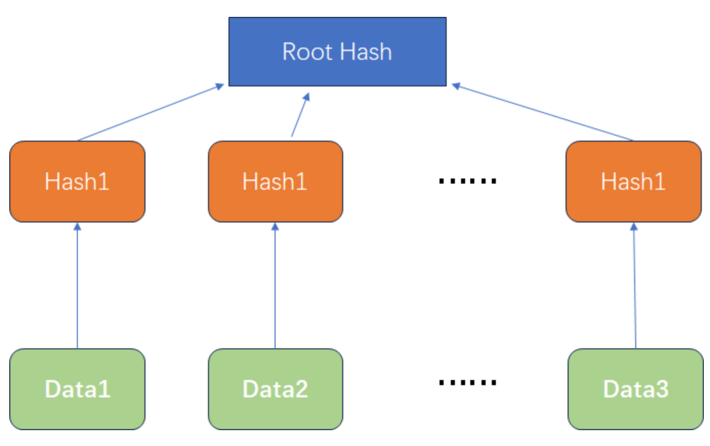

# Impl Merkle Tree following RFC6962
## 前言、项目说明

Merkle Tree，又称哈希树（Hash Tree）或加密树（Cryptographic Tree），是一种基于哈希的树状数据结构，用于验证和管理大量数据的完整性和有效性。它由Ralph Merkle在1979年首次提出，现在被广泛应用于分布式系统、加密货币和区块链等领域。

## 一、Merkle Tree

为了方便自己与读者理解，这里首先根据参考[1]讲述一下Merkle Tree的发展

### Hash

Hash函数大家非常熟悉，就是一个把任意长度的数据映射成固定长度数据的函数。例如，对于数据完整性校验，最简单的方法是对整个数据做Hash运算得到固定长度的Hash值，然后把得到的Hash值公布在网上，这样用户下载到数据之后，对数据再次进行Hash运算，比较运算结果和网上公布的Hash值进行比较，如果两个Hash值相等，说明下载的数据没有损坏。可以这样做是因为输入数据的稍微改变就会引起Hash运算结果的面目全非，而且根据Hash值反推原始输入数据的特征是困难的。

如果从一个稳定的服务器进行下载，采用单一Hash是可取的。但如果数据源不稳定，一旦数据损坏，就需要重新下载，这种下载的效率是很低的。于是有了以下的Hash List

### Hash List

在点对点网络中作数据传输的时候，会同时从多个机器上下载数据，而且很多机器可以认为是不稳定或者不可信的。为了校验数据的完整性，更好的办法是把大的文件分割成小的数据块（例如，把分割成2K为单位的数据块）。这样的好处是，如果小块数据在传输过程中损坏了，那么只要重新下载这一快数据就行了，不用重新下载整个文件。

为了确定小的数据块没有损坏，只需要为每个数据块做Hash。BT（Bit Torrent）下载的时候，在下载到真正数据之前，我们会先下载一个Hash列表。而为了确定这个Hash列表本身是正确的，需要把每个小块数据的Hash值拼到一起，然后对这个长字符串再作一次Hash运算，这样就得到Hash列表的根Hash(Top Hash or Root Hash)。下载数据的时候，首先从可信的数据源得到正确的根Hash，就可以用它来校验Hash列表了，然后通过校验后的Hash列表校验数据块。



### Merkle Tree

Merkle Tree的基本思想是，将一组数据分成不同的块，并对每个块计算Hash。然后，将这些Hash按照一定的规则组合成一个新的Hash，作为它们的父节点的Hash值。不断重复这个过程，直到所有的Hash值都被组合成一个唯一的根Hash值，即Merkle Tree的根节点。

具体来说，Merkle Tree在最底层，和Hash List一样，我们把数据分成小的数据块，有相应的hash和它对应。但是往上走，并不是直接去运算根hash，而是把相邻的两个hash合并成一个字符串，然后运算这个字符串的hash。如果最底层的hash总数是单数，那到最后必然出现一个单着的hash，这种情况就直接对它进行hash运算，所以也能得到它的hash。于是往上推，依然是一样的方式，可以得到数目更少的新一级hash，最终必然形成一棵倒挂的二叉树，到了根节点的这个位置，就剩下一个根hash了，我们把它叫做 Merkle Root。


在p2p网络下载网络之前，先从可信的源获得文件的Merkle Tree树根。一旦获得了树根，就可以从其他从不可信的源获取Merkle tree。通过可信的树根来检查接受到的Merkle Tree。如果Merkle Tree是损坏的或者虚假的，就从其他源获得另一个Merkle Tree，直到获得一个与可信树根匹配的Merkle Tree。

Merkle Tree和Hash List的主要区别是，可以直接下载并立即验证Merkle Tree的一个分支。因为可以将文件切分成小的数据块，这样如果有一块数据损坏，仅仅重新下载这个数据块就行了。如果文件非常大，那么Merkle tree和Hash list都很到，但是Merkle tree可以一次下载一个分支，然后立即验证这个分支，如果分支验证通过，就可以下载数据了。而Hash list只有下载整个hash list才能验证。

## 二、Merkle Tree特点

1. Merkle Tree是一种树，大多数是二叉树，也可以多叉树，无论是几叉树，它都具有树结构的所有特点；
2. Merkle Tree的叶子节点的value是数据集合的单元数据或者单元数据HASH。
3. 非叶子节点的value是根据它下面所有的叶子节点值，然后按照Hash算法计算而得出的。

## 三、Merkle Tree操作

1、创建Merkle Tree

2、检索数据块

3、更新、插入和删除

本次实验只用到了创建Merkle Tree，其余详细的操作可以见参考[1]、[2]

## 四、具体实现

这里实现时，使用Hash函数SHA256进行hash运算

### 创建一个Merkle Tree包含10w个节点

1. 对所有原始数据计算Hash值；注意当数据长度为奇数时，需要将最后一个Hash值再计算一次hash

   ```python
     # 计算原始数据的哈希值，hashes记录原始数据hash后的结果，nodes记录所有hash值
       hashes = [hashlib.sha256(item.encode()).hexdigest() for item in data]
       nodes = hashes
   
   ```

2. 相邻两个hash块串联，然后再做hash，不断重复这个过程，最后只剩一个hash值即为最后的Merkle Tree的根节点

   ```python
       # 构建Merkle Tree
       while len(hashes) > 1:
           # 如果数据长度为奇数，则将最后一个哈希值重复一次
           if len(hashes) % 2 == 1:
               hashes.append(hashes[-1])
           level = []
           for i in range(0, len(hashes), 2):
               left = hashes[i]
               right = hashes[i+1]
               level.append(hashlib.sha256((left + right).encode()).hexdigest())
           hashes = level
           nodes.extend(hashes)
       return hashes[0], nodes
   ```

3. 用gen_leafNode()函数随机生成10w个节点，每个元素包含3个字符的节点

```   python
#创建10w叶子结点
def gen_leafNode():
    return [''.join(random.sample('abcdefghijklmnopqrstuvwxyz0123456789',3)) for i in range(0,100000)]
```

### 进行inclusion proof（包含性证明）

#### 简要介绍

inclusion proof是一种证明某个元素包含在Merkle树中的方法，其由一组哈希值构成的列表组成，这些哈希值是从包含该元素的叶子节点到根节点的路径上的所有节点的哈希值，以及在该路径上的每个节点的兄弟节点的哈希值。通过将这些哈希值按照顺序放入一个列表中，我们可以使用包含证明来证明某个元素包含在Merkle树中。使用包含证明，我们可以在不传输整个Merkle树的情况下证明某个元素包含在其中。

#### 实现思路

1. 初始化`index`为-1，用于记录找到特定元素所在的叶子节点的位置。
2. 遍历`nodes`列表的前一半（因为`nodes`列表包含了所有节点的哈希值，前一半是叶子节点的哈希值），查找与`element`匹配的叶子节点的位置，并将其索引保存在`index`中。
3. 如果找不到与`element`匹配的叶子节点，则抛出`ValueError`异常，表示该元素不存在于Merkle Tree中。
4. 如果找到了匹配的叶子节点，就开始构建包含性证明路径
   - 从叶子节点开始，通过计算当前节点的兄弟节点的位置，将兄弟节点的哈希值添加到`proof`列表中。
   - 然后将当前节点的位置更新为其父节点的位置，继续查找兄弟节点，直到达到根节点（`index`等于0为止）。

#### 代码展示

```python
#Inclusion proof（包含性证明）
def inclusion_proof(root_hash, nodes, element):
    # 找到包含特定元素的叶子节点的位置
    index = -1
    for i in range(len(nodes) // 2):
        if nodes[i] == hashlib.sha256(element.encode()).hexdigest():
            index = i
            break
    if index == -1:
        raise ValueError("Element not found in Merkle tree")

    # 构建包含证明
    proof = []
    while index > 0:
        # 找到当前节点的兄弟节点的位置
        sibling_index = index - 1 if index % 2 == 1 else index + 1
        # 将兄弟节点的哈希值添加到证明中
        proof.append(nodes[sibling_index])
        # 更新当前节点的位置为其父节点的位置
        index = (index - 1) // 2
    return proof
```


### 进行exclusion proof（排除性证明）

#### 简要介绍

exclusion proof是一种证明某个元素不包含在Merkle树中的方法。其也由一组哈希值构成的列表组成，这些哈希值是从包含该元素的叶子节点到根节点的路径上的所有节点的兄弟节点的哈希值。排除证明不包含包含该元素的叶子节点的哈希值以及在该路径上的每个节点的哈希值。通过将这些哈希值按照顺序放入一个列表中，我们可以使用排除证明来证明某个元素不包含在Merkle Tree中。使用排除证明，我们可以在不传输整个Merkle树的情况下证明某个元素不包含在其中。

#### 实现思路

1. 使用`for`循环遍历`nodes`列表中的前半部分，即叶子节点的部分。在每次循环中，使用SHA-256哈希函数将`element`进行哈希，然后与叶子节点的哈希值进行比较。如果找到匹配的叶子节点，则将`index`更新为该叶子节点的位置，并跳出循环。
2. 如果`index`仍然保持为-1，表示在叶子节点中没有找到该元素，因此抛出`ValueError`异常，指示元素不在Merkle Tree中。
3. 若找到了特定元素的叶子节点的位置，进入循环来构建排除性证明。
4. 使用`while`循环，通过父节点逐级向上构建排除性证明路径。循环终止条件是`index`为0，表示已经到达Merkle Tree的根节点。
5. 在每次循环中，首先找到当前节点的父节点的位置（`parent_index`）。
6. 接着，找到当前节点的兄弟节点的位置（`sibling_index`）。如果当前节点是父节点的左孩子（即`index`是奇数），那么兄弟节点的位置为`parent_index * 2 + 1`，否则为`parent_index * 2`。
7. 如果兄弟节点的位置超出了`nodes`列表的范围，说明兄弟节点不存在，因此将父节点的哈希值添加到排除性证明路径中（因为只有左兄弟节点不存在时，右兄弟节点的哈希值会被添加到包含性证明路径中）。
8. 如果兄弟节点存在，则将其哈希值添加到排除性证明路径中。
9. 更新`index`为当前节点的父节点的位置，继续向上构建排除性证明路径。
10. 循环结束后，所有的排除性证明路径节点哈希值都被添加到`proof`列表中。
11. 返回排除性证明路径`proof`列表。

#### 代码展示

```python
#Exclusion_proof（排除性证明）
def exclusion_proof(root_hash, nodes, element):
    # 找到包含特定元素的叶子节点的位置
    index = -1
    for i in range(len(nodes) // 2):
        if nodes[i] == hashlib.sha256(element.encode()).hexdigest():
            index = i
            break
    if index == -1:
        raise ValueError("Element not found in Merkle tree")

    # 构建排除证明
    proof = []
    while index > 0:
        # 找到当前节点的父节点的位置
        parent_index = (index - 1) // 2
        # 将不在路径上的兄弟节点的哈希值添加到证明中
        sibling_index = parent_index * 2 + 1 if index % 2 == 1 else parent_index * 2
        if sibling_index >= len(nodes):
            # 如果兄弟节点的位置超出了节点列表的范围，则将父节点的哈希值添加到证明中
            proof.append(nodes[parent_index])
        else:
            proof.append(nodes[sibling_index])
        # 更新当前节点的位置为其父节点的位置
        index = parent_index
    return proof
```

## 五、实现效果

使用时，我们使用以下两个元素来验证：

```python
 #进行inclusion proof
    in_proof_path = inclusion_proof(MT_1_root, hash_nodes, '167')
    print(in_proof_path)

    #进行exclusion proof
    ex_proof_path = exclusio
```

最终的输出结果如下：


## 六、参考
[1]https://blog.csdn.net/wo541075754/article/details/54632929

[2]https://crypto.stackexchange.com/questions/22669/merkle-hash-tree-updates

[3]上课PPT：SM3