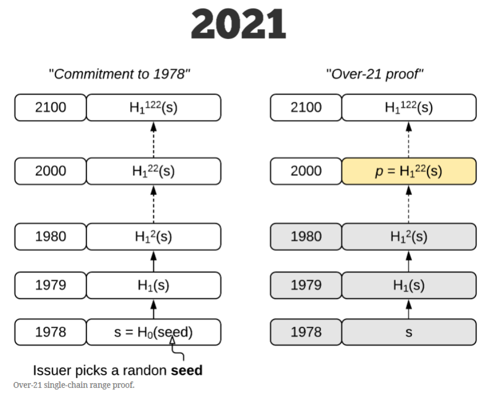
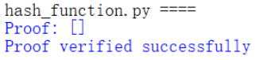
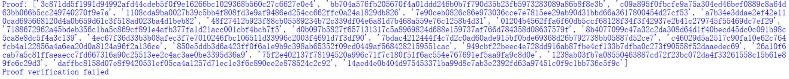

# Impl this protocol with actual network communication
## 前言、项目说明

利用hash函数实现range proof（范围证明）

## 一、Range proof
首先我们根据参考【1】来介绍一下什么是Range proof（范围证明）

Range proof（范围证明）是一种特殊的零知识证明，用于证明一个给定的数值在一个区间内，同时不泄露任何关于这个整数的信息。

一个对承诺值的典型的零知识范围证明（ZKRP）涉及密码学承诺和证明。承诺必须满足隐藏和绑定的条件，而证明必须满足完备性、合理性和零知识性。ZKRPs已经被用于在区块链上构建私人交易和以太坊上具有隐私保护的智能合约。它们还被提议用于处理偿付能力证明、电子投票和拍卖系统的隐私以及匿名凭证。

ZKRPs的一些应用存在于这样的环境中：可信实体充当生成或验证整数数值的承诺的权威。作为一个说明性的例子，考虑这样一个设定：公民希望向服务提供商证明他们的年龄超过一定的阈值，同时不透露他们自己的出生日期。受信任的实体（例如政府身份提供者）可以发布声明，承诺证明者的年龄，并且证明者有能力使用ZKRP协议生成证明，使验证者相信他们的年龄确实高于所要求的阈值。

尽管上述场景可以用现有的ZKRP结构（如Bulletproofs或Pedersen commitment）来解决，但在资源受限的环境中，这些解决方案通常不太实用，因为非对称密钥加密操作被认为是昂贵的。在需要频繁地生成和验证这些证明的应用程序中，专注于实现更简单、轻量级的原语可能是一个更有吸引力的选择。

## 二、Range proof with hash function
Hash函数可以帮助构建Range proof

假设我们要证明一个数值x在一个区间[a, b]内，其中a和b是已知的上限和下限。我们可以使用一个哈希函数H，将x和一个随机数r作为输入，产生一个哈希值h = H(x, r)。然后，我们可以将h与一个特定的比较值c进行比较，以证明x在指定区间内。比较值c的选择取决于所需的证明强度和精度。

阈值c的选取：

c = H(a, r) + (x - a) * H(b - a, r)

其中，H(a, r)和H(b - a, r)是使用相同的随机数r和哈希函数H计算的哈希值。如果h小于等于c，则我们可以证明x在区间[a, b]内。

参考【1】的论文中介绍了他们的工作：使用Hash函数来完成range proof，并构建了一个新的协议：HashWires。

虽然本次project并没有完全用到以下的参考文献，但是在学习零知识证明以及range proof时还找到了其他介绍这些知识的好的文章便一并放到了参考中。

## 三、具体实现
### 总体流程

根据下述过程可以完成本次project：



### Alice构造证明

#### 代码思路

1. 初始化证明列表：`proof` 空列表，用于存储构建的证明。
2. 进入 while 循环：为了重复进行证明的构建，直到找到满足条件的哈希值。
3. 判断证明结束条件：在每次循环的开头，代码通过比较当前哈希值 `h` 的整数表示是否小于等于比较值 `c` 的整数表示，来判断是否结束证明构建。如果满足条件，即 `int(h, 16) <= c`，则证明结束，跳出循环。
4. 计算新的哈希值和比较值：如果证明还未结束，则执行以下操作：
   - 通过哈希函数 `hash_func(r, h)` 计算一个新的随机数 `r` 的哈希值，并将其转换为整数。
   - 使用新的随机数 `r` 和 Alice 的年龄 `age` 计算新的哈希值 `h`。
   - 使用新的随机数 `r`，下限 `lower_bound` 和上限 `upper_bound` 计算新的比较值 `c`。
5. 添加哈希值到证明中：在每次循环中，将当前的哈希值 `h` 添加到证明列表 `proof` 中。

通过以上步骤，代码会在循环中不断计算新的哈希值和比较值，并将哈希值添加到证明列表中，直到找到一个满足条件的哈希值（即哈希值小于等于比较值），此时证明构建结束，退出循环。最终，`proof` 列表中将包含一系列哈希值，这些哈希值构成了证明的内容，证明了 Alice 的年龄满足一定的条件。

#### 代码展现

```python
# Alice构建证明
proof = []
while True:
    # 如果当前值小于等于比较值，则证明结束
    if int(h, 16) <= c:
        break
    # 否则，计算新的哈希值和比较值，并将哈希值添加到证明中
    r = int(hash_func(r, h), 16)
    h = hash_func(age, r)
    c = int(hash_func(lower_bound, r), 16) + (age - lower_bound) * int(hash_func(upper_bound - lower_bound, r), 16)
    proof.append(h)
```

### Bob验证证明

#### 代码思路

1. 重新选择随机数：Bob首先选择一个新的随机数 r，这是为了防止重复使用相同的随机数，增加系统的安全性。
2. 循环遍历证明列表：代码通过一个 for 循环遍历 Alice 提供的证明列表 proof。
3. 计算新的比较值 c：对于每个证明中的哈希值 h，Bob 使用相同的随机数 r 和与 Alice 构建证明时相同的方式来计算新的比较值 c。这包括计算哈希值 h 对应的年龄范围内的哈希值数量，并加上哈希值 h 在区间范围内的偏移量。
4. 进行比较：Bob 将当前证明的哈希值 h 转换为整数，并将其与新的比较值 c 进行比较。
5. 验证结果：如果任何一个证明的哈希值大于其对应的比较值 c，说明验证失败，此时输出 "Proof verification failed" 并跳出循环。否则，所有证明验证成功，并输出 "Proof verified successfully"。

这段代码的逻辑是使用 Bob 自己选择的新随机数 r，并对每个证明中的哈希值进行验证。通过与 Alice 构建证明时使用相同的方式计算新的比较值 c，并将其与哈希值 h 进行比较，来判断证明的有效性。如果所有证明都验证成功，即所有的哈希值都在对应的区间内，那么可以认为 Alice 提供的证明是有效的。否则，如果有任何一个证明失败，即哈希值超出了区间范围，那么验证将失败。

#### 代码呈现

```python
# Bob验证证明
r = random.randint(1,10000) # 重新选择随机数
for h in proof:
    c = int(hash_func(lower_bound, r), 16) + (age - lower_bound) * int(hash_func(upper_bound - lower_bound, r), 16)
    if int(h, 16) > c:
        print("Proof verification failed")
        break
    r = int(hash_func(r, h), 16)
else:
    print("Proof verified successfully")
```

## 四、实现效果

当Alice用实际年龄时（43岁），可以得到验证通过：



当欺骗者以不到21岁的年龄进行欺骗时（如20岁），则可以发现无法通过验证：



## 五、参考

【1】https://eprint.iacr.org/2021/297.pdf

【2】https://zkproof.org/2021/05/05/hashwires-range-proofs-from-hash-functions/

【3】https://arxiv.org/abs/1907.06381

【4】https://blog.csdn.net/weixin_41746734/article/details/115030537

【5】https://cloud.tencent.com/developer/article/1682725

【6】PPT：20230330-sm3-public