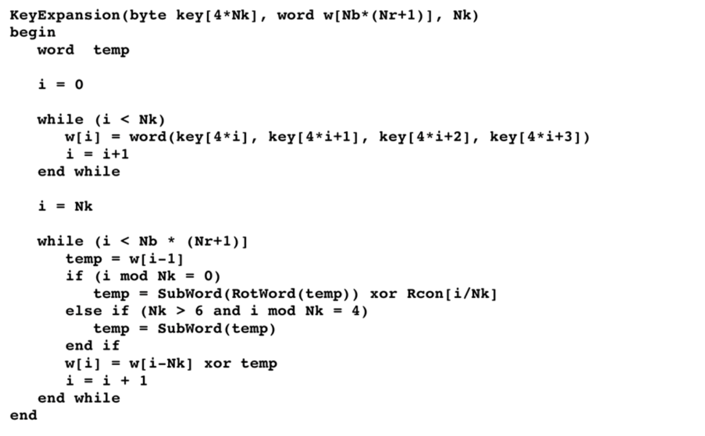
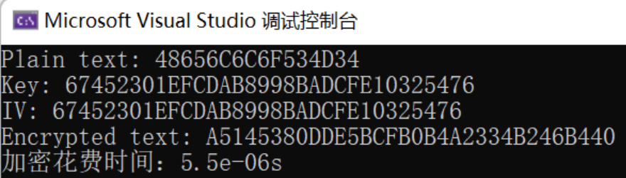

# AES and SM4 software implementation

## 前言、项目说明

 本项目完成了了AES和SM4的软件实现

## 一、AES实现
### 1. AES算法简介

算法流程如下所示：

#### SubBytes（S盒）

##### 性质：

- 对每个字节进行替换，是唯一的非线性部件
- 16个字节采用相同的S盒

##### 选取原则：

- 非线性度
  - 输入输出相关度越小越好
  - 最大差分传播概率越小越好($2^{-6}$)
- 代数复杂度
  - 布尔函数的表达式必须复杂
- 可逆

**ShiftRows（行移位）**

- 移位方式：第一、二、三、四行分别按字节循环左移0、1、2、3个字节
- 效果：某一列的四个字节扩散到4列

**MixColumns（列混淆）**

- 是$GF(2^8)$上的惩罚。模不可约多项式$m(x)$的乘法运算

**AddRoundKeys（轮密钥加）**

- 每个字节与轮密钥的对应字节进行异或运算

**密钥置换函数**

### 2. 具体实现

实现时，当明文分组长度不够时，进行填充。

### 3. 实现效果

加密如下：

## 二、SM4实现

### 1. SM4算法简介

SM4算法主要流程如下所示：

**轮函数**

**合成置换与反序变换**

**密钥扩展算法**

### 2. 具体实现
#### 1）不借助库用C++

见project_sm4_original.cpp

#### 2）借助OpenSSL库

### 3. 实现效果

明文与密钥如下：

加密结果如下：

## 三、参考

PPT：20230331-sm4-public